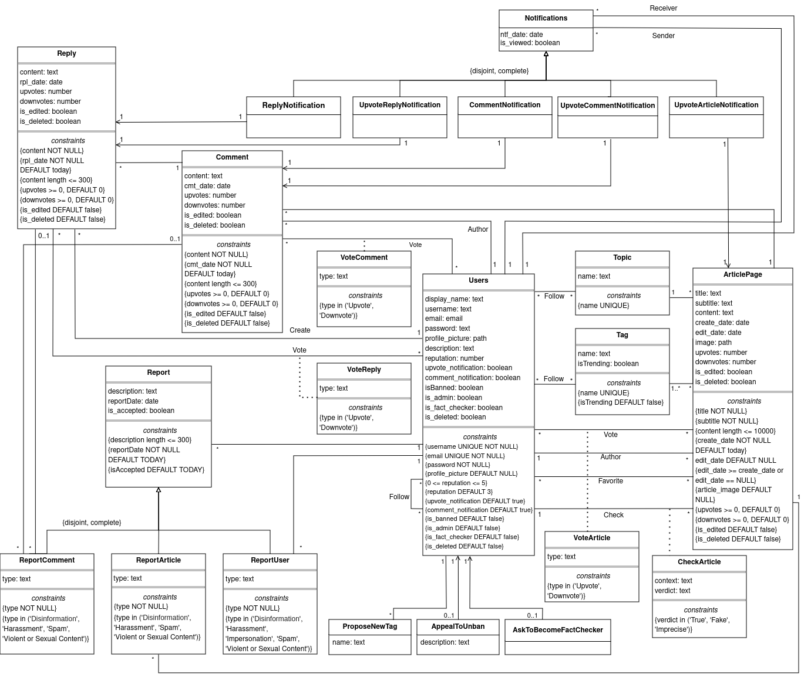

# EBD: Database Specification Component

### Project vision:

NewFlow is a news platform that connects authors and readers, making relevant information accessible in FEUP. We aim to create a community-driven space for sharing and engaging with news, prioritizing accuracy and transparency.

## A4: Conceptual Data Model

This section will showcase and describe the entities that compose the New Flow's system and the relationships between them, as well as its database specification.

### 1. Class Diagram

The UML diagram below highlights the main components of our system and respective attributes, along with the relationships between them and their corresponding multiplicity.



### 2. Additional Business Rules

Additional business rules that could not have been conveyed through the class diagram.

<table>
<tr>

<td>

**Identifier**

</td>

<td>

**Name**

</td>

<td>

**Description**

</td>

</tr>
<tr>

<td>BR1</td>
<td>Deleted accounts</td>
<td>
Upon account deletion, shared user data (e.g. comments, likes, dislikes) is kept but is made anonymous.
</td>

</tr>
<tr>

<td>BR3</td>
<td>Record Keeping</td>
<td>
A post or comment cannot be deleted by its author if it has votes or comments. Instead, if a user wishes to delete a comment, its content will be set to "This article/comment has been deleted by the user", the author will be set to anonymous and the user will lose edit privileges.
</td>

</tr>
<tr>

<td>BR4</td>
<td>Fake Article</td>
<td>
A news article that contains purposefully false information will have its visibility reduced.
</td>

</tr>
<tr>

<td>BR5</td>
<td>Account Ban Policy</td>
<td>
If a user commits any misconduct when having a reputation of 0, they will be banned and need to appeal if they want their account back.
</td>

</tr>
<tr>

<td>BR7</td>
<td>Delete User</td>
<td>
When a user wishes to delete their account, all the personal information will be set to "deleted" but the user will remain in the database to retain all their interactions with the system. Their posts will have the author be considered anonymous.
</td>

</tr>
<tr>

<td>BR8</td>
<td>Special Characters</td>
<td>
Some input fields such as username will not allow the user to input special characters.
</td>

</tr>
<tr>

<td>BR11</td>
<td>Follow Restrictions</td>
<td>
A user cannot follow themselves.
</td>

</tr>
<tr>

<td>BR12</td>
<td>Vote Restrictions</td>
<td>
A user can only have up to one vote per post and that vote can either be an upvote or a downvote.
</td>

</tr>
</table>

Table 12: NewFlow Business Rules

## A5: Relational Schema, validation and schema refinement

The section below describes the Relational Schema obtained from the Conceptual Data Model. It analyses it, highlighting the domains, primary keys, foreign keys, and integrity rules. It also shows the schema's validation, including the functional dependencies and normalization.

### 1. Relational Schema

The Relational Schema includes the attributes, domains, primary keys, foreign keys, default values and other integrity rules such as UNIQUE, DEFAULT, NOT NULL, CHECK.

| Relation reference | Relation Compact Notation                                                                                                                                                                                                                                                                                                                                                       |
| ------------------ | ------------------------------------------------------------------------------------------------------------------------------------------------------------------------------------------------------------------------------------------------------------------------------------------------------------------------------------------------------------------------------- |
| R01                | Users(id **PK**, display_name **DF** null, username **UK** **NN**, email **UK** **NN**, password **NN**, profile_picture **DF** null, description, reputation **CK** 0 <= reputation <= 5 **DF** 3, upvote_notification **DF** true, comment_notification **DF** true, is_banned **DF** false, is_admin **DF** false, is_fact_checker **DF** false, is_deleted **DF** false)    |
| R02                | FollowUser(follower_id **PK** -> Users, following_id **PK** -> Users)                                                                                                                                                                                                                                                                                                           |
| R03                | VoteArticle(user_id **PK** -> Users, article_id **PK** -> ArticlePage, type **CK** type IN vote_types)                                                                                                                                                                                                                                                                          |
| R04                | FavouriteArticle(user_id **PK** -> Users, article_id **PK** -> ArticlePage)                                                                                                                                                                                                                                                                                                     |
| R05                | CheckArticle(article_id **PK** -> ArticlePage, user_id -> Users **NN**, context, verdict **NN** **CK** verdict IN verdict_types)                                                                                                                                                                                                                                                |
| R06                | ArticlePage(id **PK**, title **NN**, subtitle **NN**, content, create_date **NN** **DF** today, edit_date **CK** edit_date = null OR edit_date >= create_date **DF** null, article_image, upvotes **CK** upvotes >= 0 **DF** 0, downvotes **CK** downvotes >= 0 **DF** 0, is_edited **DF** false, is_deleted **DF** false, topic_id -> Topic **NN**, author_id -> Users **NN**) |
| R07                | ArticleTag(article_id **PK** -> ArticlePage, tag_id **PK** -> Tag)                                                                                                                                                                                                                                                                                                              |
| R08                | Topic(id **PK**, name)                                                                                                                                                                                                                                                                                                                                                          |
| R09                | FollowTopic(user_id **PK** -> Users, topic_id **PK** -> Topic)                                                                                                                                                                                                                                                                                                                  |
| R10                | Tag(id **PK**, name, is_trending **DF** false)                                                                                                                                                                                                                                                                                                                                  |
| R11                | FollowTag(user_id **PK** -> Users, tag_id **PK** -> Tag )                                                                                                                                                                                                                                                                                                                       |
| R12                | Comment(id **PK**, content **NN**, cmt_date **NN** **DF** today, upvotes **CK** upvotes >= 0 **DF** 0, downvotes **CK** downvotes >= 0 **DF** 0, is_edited **DF** false, is_deleted **DF** false, author_id -> Users **NN**, article_id -> ArticlePage **NN**)                                                                                                                  |
| R13                | VoteComment(user_id **PK** -> Users, comment_id **PK** -> Comment, type **CK** type IN vote_types **DF** 'Upvote')                                                                                                                                                                                                                                                              |
| R14                | Reply(id **PK**, content **NN**, rpl_date **NN** **DF** today, upvotes **CK** upvotes >= 0 **DF** 0, downvotes **CK** downvotes >= 0 **DF** 0, is_edited **DF** false, is_deleted **DF** false, author_id -> Users **NN**, comment_id -> Comment **NN**)                                                                                                                        |
| R15                | VoteReply(user_id **PK** -> Users, reply_id -> Reply, type **CK** type IN vote_types)                                                                                                                                                                                                                                                                                           |
| R16                | Report(id **PK**, description, report_date **NN** **DF** today, is_accepted **DF** false, reporter_id -> Users **NN**)                                                                                                                                                                                                                                                          |
| R17                | ReportComment(id **PK**, type **NN** **CK** type IN report_comment_types, report_id -> Report **NN**, comment_id -> Comment, reply_id -> Reply **...**)                                                                                                                                                                                                                         |
| R18                | ReportArticle(id **PK**, type **NN** **CK** type IN report_article_types, report_id -> Report, article_id -> ArticlePage)                                                                                                                                                                                                                                                       |
| R19                | ReportUser(id **PK**, type **NN** **CK** type in report_user_types, report_id -> Report, user_id -> Users)                                                                                                                                                                                                                                                                      |
| R20                | ProposeNewTag(id **PK**, name, user_id -> Users)                                                                                                                                                                                                                                                                                                                                |
| R21                | AppealToUnban(id **PK**, description, user_id -> Users **NN**)                                                                                                                                                                                                                                                                                                                  |
| R22                | AskToBecomeFactChecker(id **PK**, user_id -> Users **NN**)                                                                                                                                                                                                                                                                                                                      |
| R23                | Notifications(id **PK**, ntf_date **NN** **DF** today, is_viewed **DF** false, user_to -> Users **NN**, user_from -> Users **NN**)                                                                                                                                                                                                                                              |
| R24                | ReplyNotification(id **PK**, ntf_id -> Notifications **NN**, reply_id -> Reply **NN**)                                                                                                                                                                                                                                                                                          |
| R25                | UpvoteReplyNotification(id **PK**, ntf_id -> Notifications **NN**, reply_id -> Reply **NN**)                                                                                                                                                                                                                                                                                    |
| R26                | CommentNotification(id **PK**, ntf_id -> Notifications **NN**, comment_id -> Comment **NN**)                                                                                                                                                                                                                                                                                    |
| R27                | UpvoteCommentNotification(id **PK**, ntf_id -> Notifications **NN**, comment_id -> Comment **NN**)                                                                                                                                                                                                                                                                              |
| R28                | UpvoteArticleNotification(id **PK**, ntf_id -> Notifications **NN**, article_id -> ArticlePage **NN**)                                                                                                                                                                                                                                                                          |

Table 13: NewFlow Relational Schema

Legend:

- PK = PRIMARY KEY
- UK = UNIQUE KEY
- NN = NOT NULL
- DF = DEFAULT
- CK = CHECK.

### 2. Domains

Specification of additional domains

| Domain Name          | Domain Specification                                                                       |
| -------------------- | ------------------------------------------------------------------------------------------ |
| today                | DATE DEFAULT CURRENT_DATE                                                                  |
| vote_types           | ENUM ('Upvote', 'Downvote')                                                                |
| verdict_types        | ENUM ('True', 'False', 'Imprecise')                                                        |
| report_comment_types | ENUM ('Disinformation', 'Harassment', 'Spam', 'Violence or Sexual Content')                |
| report_article_types | ENUM ('Fact Check', 'Harassment', 'Spam', 'Violence or Sexual Content')                    |
| report_user_types    | ENUM ('Disinformation', 'Harassment', 'Spam', 'Violence or Sexual Content', Impersonation) |

Table 14: NewFlow Domains

### 3. Schema validation

After obtaining the Relational Schema from the Conceptual Model, it is necessary to validate it. This validation includes the identification of all functional dependencies and the normalization of all relation schemas, in order to refine them, until they are in Boyce-Codd Normal Form (BCNF). In some cases, that was not possible or necessary, as detailed below.

| **TABLE R01**                | Users                                                                                                                                                                                   |
| ---------------------------- | --------------------------------------------------------------------------------------------------------------------------------------------------------------------------------------- |
| **Keys**                     | {id}, {username}, {email}                                                                                                                                                               |
| **Functional Dependencies:** |                                                                                                                                                                                         |
| FD0101                       | {id} → {display_name, username, email, password, profile_picture, description, reputation, upvote_notification, comment_notification, is_banned, is_deleted, is_admin, is_fact_checker} |
| FD0102                       | {username} → {display_name, id, email, password, profile_picture, description, reputation, upvote_notification, comment_notification, is_banned, is_deleted, is_admin, is_fact_checker} |
| FD0103                       | {email} → {display_name, id, username, password, profile_picture, description, reputation, upvote_notification, comment_notification, is_banned, is_deleted, is_admin, is_fact_checker} |
| **NORMAL FORM**              | 3NF                                                                                                                                                                                     |

Table 15: Users schema validation

> Note: The Users table (in plural due to the reserved word "User" in PostgreSQL) is not in BCNF because, in the functional dependencies FD0102 and FD0103, the left side is not a superkey:
> The username and email are unique keys, and used for login purposes. It's due to this uniqueness that they determine the other attributes in the table.
>
> - Separating them into a Login table would normalize the Users table to BCNF, but it would shift the exact same problem to the Login table, which would not be in BCNF.
> - Separating them into a Username and Email table would not be a good idea, as it would not make sense in the real world, and it would add unnecessary complexity to the schema, even though it would normalize all the tables to BCNF.
> - Using a composite key with id, username and email would unnecessarily add foreign key complexity, add redundancy and performance overhead.
>
> Therefore, we decided to keep the Users table in 3NF - with id as the primary key - because it is the most practical and logical solution.

| **TABLE R02**                | FollowUser                  |
| ---------------------------- | --------------------------- |
| **Keys**                     | {follower_id, following_id} |
| **Functional Dependencies:** | _NONE_                      |
| **NORMAL FORM**              | BCNF                        |

Table 16: FollowUser schema validation

| **TABLE R03**                | VoteArticle                    |
| ---------------------------- | ------------------------------ |
| **Keys**                     | {user_id, article_id}          |
| **Functional Dependencies:** |                                |
| FD0301                       | {user_id, article_id} → {type} |
| **NORMAL FORM**              | BCNF                           |

Table 17: VoteArticle schema validation

| **TABLE R04**                | FavouriteArticle      |
| ---------------------------- | --------------------- |
| **Keys**                     | {user_id, article_id} |
| **Functional Dependencies:** | _NONE_                |
| **NORMAL FORM**              | BCNF                  |

Table 18: FavouriteArticle schema validation

| **TABLE R05**                | CheckArticle                               |
| ---------------------------- | ------------------------------------------ |
| **Keys**                     | {article_id, user_id}                      |
| **Functional Dependencies:** |                                            |
| FD0501                       | {article_id, user_id} → {context, verdict} |
| **NORMAL FORM**              | BCNF                                       |

Table 19: CheckArticle schema validation

| **TABLE R06**                | ArticlePage                                                                                                                       |
| ---------------------------- | --------------------------------------------------------------------------------------------------------------------------------- |
| **Keys**                     | {id}                                                                                                                              |
| **Functional Dependencies:** |                                                                                                                                   |
| FD0601                       | {id} -> {title, subtitle, content, create_date, edit_date, image, upvotes, downvotes, is_edited, is_deleted, topic_id, id_author} |
| **NORMAL FORM**              | BCNF                                                                                                                              |

Table 20: ArticlePage schema validation

| **TABLE R07**                | ArticleTag           |
| ---------------------------- | -------------------- |
| **Keys**                     | {article_id, tag_id} |
| **Functional Dependencies:** | _NONE_               |
| **NORMAL FORM**              | BCNF                 |

Table 21: ArticleTag schema validation

| **TABLE R08**                | Topic          |
| ---------------------------- | -------------- |
| **Keys**                     | {id}           |
| **Functional Dependencies:** |                |
| FD0801                       | {id} -> {name} |
| FD0802                       | {name} -> {id} |
| **NORMAL FORM**              | 3NF            |

Table 22: Topic schema validation

> Note: The Topic table is not in BCNF because, in the functional dependency FD0702, the left side is not a superkey. This is because of the restriction that natural keys cannot be primary keys. Topics' names are a natural key because they are unique, due to their meaning in real life, and identify a line in the table. Therefore, it is in 3NF.

| **TABLE R09**                | FollowTopic         |
| ---------------------------- | ------------------- |
| **Keys**                     | {user_id, topic_id} |
| **Functional Dependencies:** | _NONE_              |
| **NORMAL FORM**              | BCNF                |

Table 23: FollowTopic schema validation

| **TABLE R10**                | Tag                        |
| ---------------------------- | -------------------------- |
| **Keys**                     | {id}, {name}               |
| **Functional Dependencies:** |                            |
| FD1001                       | {id} → {name, is_trending} |
| FD1002                       | {name} → {id, is_trending} |
| **NORMAL FORM**              | 3NF                        |

Table 24: Tag schema validation

> Note: The Tag table is not in BCNF because, in the functional dependency FD1002, the left side is not a superkey. This is because of the restriction that natural keys cannot be primary keys. Tags' names are a natural key because they are unique, due to their meaning in real life, and identify a line in the table. Therefore, it is in 3NF.

| **TABLE R11**                | FollowTag         |
| ---------------------------- | ----------------- |
| **Keys**                     | {user_id, tag_id} |
| **Functional Dependencies:** | _NONE_            |
| **NORMAL FORM**              | BCNF              |

Table 25: FollowTag schema validation

| **TABLE R12**                | Comment                                                                                      |
| ---------------------------- | -------------------------------------------------------------------------------------------- |
| **Keys**                     | {id}                                                                                         |
| **Functional Dependencies:** |                                                                                              |
| FD1201                       | {id} → {content, cmt_date, upvotes, downvotes, is_edited, is_deleted, author_id, article_id} |
| **NORMAL FORM**              | BCNF                                                                                         |

Table 26: Comment schema validation

| **TABLE R13**                | VoteComment                    |
| ---------------------------- | ------------------------------ |
| **Keys**                     | {user_id, comment_id}          |
| **Functional Dependencies:** |                                |
| FD1301                       | {user_id, comment_id} → {type} |
| **NORMAL FORM**              | BCNF                           |

Table 27: VoteComment schema validation

| **TABLE R14**                | Reply                                                                                        |
| ---------------------------- | -------------------------------------------------------------------------------------------- |
| **Keys**                     | {id}                                                                                         |
| **Functional Dependencies:** |                                                                                              |
| FD1401                       | {id} → {content, rpl_date, upvotes, downvotes, is_edited, is_deleted, author_id, comment_id} |
| **NORMAL FORM**              | BCNF                                                                                         |

Table 28: Reply schema validation

| **TABLE R15**                | VoteReply                    |
| ---------------------------- | ---------------------------- |
| **Keys**                     | {user_id}                    |
| **Functional Dependencies:** |                              |
| FD1501                       | {user_id} → {reply_id, type} |
| **NORMAL FORM**              | BCNF                         |

Table 29: VoteReply schema validation

| **TABLE R16**                | Report                                                      |
| ---------------------------- | ----------------------------------------------------------- |
| **Keys**                     | {id}                                                        |
| **Functional Dependencies:** |                                                             |
| FD1601                       | {id} → {description, report_date, is_accepted, reporter_id} |
| **NORMAL FORM**              | BCNF                                                        |

Table 30: Report schema validation

| **TABLE R17**                | ReportComment                                  |
| ---------------------------- | ---------------------------------------------- |
| **Keys**                     | {id}                                           |
| **Functional Dependencies:** |                                                |
| FD1701                       | {id} → {type, report_id, comment_id, reply_id} |
| **NORMAL FORM**              | BCNF                                           |

Table 31: ReportComment schema validation

| **TABLE R18**                | ReportArticle                      |
| ---------------------------- | ---------------------------------- |
| **Keys**                     | {id}                               |
| **Functional Dependencies:** |                                    |
| FD1801                       | id → {type, report_id, article_id} |
| **NORMAL FORM**              | BCNF                               |

Table 32: ReportArticle schema validation

| **TABLE R19**                | ReportUser                        |
| ---------------------------- | --------------------------------- |
| **Keys**                     | {id}                              |
| **Functional Dependencies:** |                                   |
| FD1901                       | {id} → {type, report_id, user_id} |
| **NORMAL FORM**              | BCNF                              |

Table 33: ReportUser schema validation

| **TABLE R20**                | ProposeNewTag          |
| ---------------------------- | ---------------------- |
| **Keys**                     | {id}                   |
| **Functional Dependencies:** |                        |
| FD2001                       | {id} → {name, user_id} |
| **NORMAL FORM**              | BCNF                   |

Table 34: ProposeNewTag schema validation

| **TABLE R21**                | AppealToUnban                 |
| ---------------------------- | ----------------------------- |
| **Keys**                     | {id}                          |
| **Functional Dependencies:** |                               |
| FD2101                       | {id} → {description, user_id} |
| **NORMAL FORM**              | BCNF                          |

Table 35: AppealToUnban schema validation

| **TABLE R22**                | AskToBecomeFactChecker |
| ---------------------------- | ---------------------- |
| **Keys**                     | {id}                   |
| **Functional Dependencies:** |                        |
| FD2201                       | {id} → {user_id}       |
| **NORMAL FORM**              | BCNF                   |

Table 36: AskToBecomeFactChecker schema validation

| **TABLE R23**                | Notifications                                    |
| ---------------------------- | ------------------------------------------------ |
| **Keys**                     | {id}                                             |
| **Functional Dependencies:** |                                                  |
| FD2301                       | {id} → {ntf_date, is_viewed, user_to, user_from} |
| **NORMAL FORM**              | BCNF                                             |

Table 37: Notifications schema validation

> Note: The Notifications table is in plural due to the incompatibility (not compiling) with word "Notification" in PostgreSQL.

| **TABLE R24**                | ReplyNotification         |
| ---------------------------- | ------------------------- |
| **Keys**                     | {id}                      |
| **Functional Dependencies:** |                           |
| FD2401                       | {id} → {ntf_id, reply_id} |
| **NORMAL FORM**              | BCNF                      |

Table 38: ReplyNotification schema validation

| **TABLE R25**                | UpvoteReplyNotification   |
| ---------------------------- | ------------------------- |
| **Keys**                     | {id}                      |
| **Functional Dependencies:** |                           |
| FD2501                       | {id} → {ntf_id, reply_id} |
| **NORMAL FORM**              | BCNF                      |

Table 39: UpvoteReplyNotification schema validation

| **TABLE R26**                | CommentNotification         |
| ---------------------------- | --------------------------- |
| **Keys**                     | {id}                        |
| **Functional Dependencies:** |                             |
| FD2601                       | {id} → {ntf_id, comment_id} |
| **NORMAL FORM**              | BCNF                        |

Table 40: CommentNotification schema validation

| **TABLE R27**                | UpvoteCommentNotification   |
| ---------------------------- | --------------------------- |
| **Keys**                     | {id}                        |
| **Functional Dependencies:** |                             |
| FD2701                       | {id} → {ntf_id, comment_id} |
| **NORMAL FORM**              | BCNF                        |

Table 41: UpvoteCommentNotification schema validation

| **TABLE R28**                | UpvoteArticleNotification   |
| ---------------------------- | --------------------------- |
| **Keys**                     | {id}                        |
| **Functional Dependencies:** |                             |
| FD2801                       | {id} → {ntf_id, article_id} |
| **NORMAL FORM**              | BCNF                        |

Table 42: UpvoteArticleNotification schema validation

All tables except Users, Topic and Tag are in BCNF. Those tables are in 3NF, as explained in the notes above. No further normalization in any tables was necessary, during the conversion from the Conceptual Model to the Relational Schema.

## A6: Indexes, triggers, transactions and database population

This last artifact is composed of PostgreSQL code and other aspects of the database itself, like the expected workload. In more detail, it includes the database creation script, the definition and justification of indexes, additional enforcement of integrity rules with triggers, and transactions that guarantee data integrity during concurrent database operations.

### 1. Database Workload

The project workload demonstrates the predicted evolution of the database growth over the days. As a consequence, the tables from the database will eventually reach an estimate order of magnitude. Thus, it is important to design a good database from its roots, since the decisions in the development and maintenance stages will be directly affected by how the system will be over time. The following table depicts the expected numbers for each relation:

| **Relation reference** | **Relation Name**         | **Order of magnitude** | **Estimated growth** |
| ---------------------- | ------------------------- | ---------------------- | -------------------- |
| R01                    | user                      | 10k                    | 10 / day             |
| R02                    | followuser                | 10k                    | 10 / day             |
| R03                    | votearticle               | 10k                    | 100 / day            |
| R04                    | favouritearticle          | 10k                    | 10 / day             |
| R05                    | checkarticle              | 10                     | 1 / day              |
| R06                    | articlepage               | 1k                     | 100 / day            |
| R07                    | articletag                | 1k                     | 100 / day            |
| R08                    | topic                     | 10                     | 0 / day              |
| R09                    | followtopic               | 10k                    | 1 / day              |
| R10                    | tag                       | 100                    | 1 / day              |
| R11                    | followtag                 | 10k                    | 10 / day             |
| R12                    | comment                   | 10k                    | 100 / day            |
| R13                    | votecomment               | 10k                    | 100 / day            |
| R14                    | reply                     | 10k                    | 100 / day            |
| R15                    | votereply                 | 1k                     | 10 / day             |
| R16                    | report                    | 10                     | 1 / day              |
| R17                    | reportcomment             | 1                      | 1 / day              |
| R18                    | reportarticle             | 10                     | 1 / day              |
| R19                    | reportuser                | 1                      | 1 / day              |
| R20                    | proposenewtag             | 10                     | 1 / day              |
| R21                    | appealtounban             | 10                     | 1 / day              |
| R22                    | asktobecomefactchecker    | 10                     | 1 / day              |
| R23                    | notification              | 10k                    | 1k / day             |
| R24                    | replynotification         | 1k                     | 100 / day            |
| R25                    | upvotereplynotification   | 1k                     | 100 / day            |
| R26                    | commentnotification       | 1k                     | 100 / day            |
| R27                    | upvotecommentnotification | 1k                     | 10 / day             |
| R28                    | upvotearticlenotification | 10 k                   | 100 / day            |

Table 43: NewFlow's database workload

### 2. Proposed Indices

To obtain a faster retrieval of particular rows, we used indexes in a few tables where the table scale and complexity of queries are a factor in the database performance. Notably, the indexes increase efficiency in queries with joins and extensive search filters, where UPDATE and DELETE operations are involved. Nevertheless, implementing indexes for every table in the database would consume large amounts of memory, which could flatten the performance. Consequently, we selected tabled where indexes could be the most advantageous.

#### 2.1: Performance Indexes

In this section, it is displayed the indexes we will use for acquiring performance bonuses in tables that depend on SELECT queries. Though bearing in mind that INSERT, UPDATE and DELETE operations on the tables will suffer some delays in speed, the following tables include performance indexes:

| Index               | IDX01                                                                                                                                                                                                                                                                                                                                                                                                                       |
| ------------------- | --------------------------------------------------------------------------------------------------------------------------------------------------------------------------------------------------------------------------------------------------------------------------------------------------------------------------------------------------------------------------------------------------------------------------- |
| **Index relation**  | ArticlePage                                                                                                                                                                                                                                                                                                                                                                                                                 |
| **Index attribute** | id_author                                                                                                                                                                                                                                                                                                                                                                                                                   |
| **Index type**      | B-tree                                                                                                                                                                                                                                                                                                                                                                                                                      |
| **Cardinality**     | Medium                                                                                                                                                                                                                                                                                                                                                                                                                      |
| **Clustering**      | No                                                                                                                                                                                                                                                                                                                                                                                                                          |
| **Justification**   | Table ‘ArticlePage’ is large due to the increasing number of users signing up for the application. It is important for users to see the articles posted by a specific author (user). A hash table would be useful if the table weren't subject to constant additions and deletions. The B-tree supports efficient lookups. Clustering is not recommended, as entries of users would disrupt the physical order of articles. |
| **SQL Code**        | `CREATE INDEX i_article_author ON ArticlePage (author_id);`                                                                                                                                                                                                                                                                                                                                                                 |

Table 44: Article Page Author Index

| Index               | IDX02                                                                                                                                                                                                                          |
| ------------------- | ------------------------------------------------------------------------------------------------------------------------------------------------------------------------------------------------------------------------------ |
| **Index relation**  | Notifications                                                                                                                                                                                                                  |
| **Index attribute** | ntf_date                                                                                                                                                                                                                       |
| **Index type**      | B-tree                                                                                                                                                                                                                         |
| **Cardinality**     | Medium                                                                                                                                                                                                                         |
| **Clustering**      | No                                                                                                                                                                                                                             |
| **Justification**   | Indexing the ntf_date attribute will improves performance for queries that filter or sort notifications by date. This will be useful, especially when retrieving recent notifications and searching for their respective date. |
| **SQL Code**        | `CREATE INDEX i_notifications_date ON Notifications(ntf_date DESC);`                                                                                                                                                           |

Table 45: Notifications Date Index

| Index               | IDX03                                                                                                                                                                                                                                                                                                                                                                    |
| ------------------- | ------------------------------------------------------------------------------------------------------------------------------------------------------------------------------------------------------------------------------------------------------------------------------------------------------------------------------------------------------------------------ |
| **Index relation**  | ArticlePage                                                                                                                                                                                                                                                                                                                                                              |
| **Index attribute** | create_date                                                                                                                                                                                                                                                                                                                                                              |
| **Index type**      | B-tree                                                                                                                                                                                                                                                                                                                                                                   |
| **Cardinality**     | Medium                                                                                                                                                                                                                                                                                                                                                                   |
| **Clustering**      | No                                                                                                                                                                                                                                                                                                                                                                       |
| **Justification**   | The table will increase in number the same as table ‘ArticlePage’, thus clustering wouldn’t be a good idea, even though it would’ve been useful as dates follow an order. B-tree would ensure data is organized equally, in particular, searching for a specific data or range will be fast. Hash type index would have trouble ordering dates, so not recommended here. |
| **SQL Code**        | `CREATE INDEX i_article_cdate ON ArticlePage(create_date DESC);`                                                                                                                                                                                                                                                                                                         |

Table 46: Article Page Date Index

#### 2.2: Full-Text Search indexes

Letting the user search through multiple options is required on the development of the project. Thus, to improve retrieval time, and, as consequence, the user experience, we depicted below how full-text search would be obtainable in certain tables and attributes.

<table>
  <tr>
    <th>Index</th>
    <th>IDX04</th>
  </tr>
  <tr>
    <td><strong>Index relation</strong></td>
    <td>ArticlePage</td>
  </tr>
  <tr>
    <td><strong>Index attribute</strong></td>
    <td>title, subtitle, content</td>
  </tr>
  <tr>
    <td><strong>Index type</strong></td>
    <td>GIN</td>
  </tr>
  <tr>
    <td><strong>Clustering</strong></td>
    <td>No</td>
  </tr>
  <tr>
    <td><strong>Justification</strong></td>
    <td>To search articles based on the words inside of its text, which could be in the title, subtitle, or content. The approach of search is full-text, which means the best index type is GIN, due to the contents of attributes not changing as often.</td>
  </tr>
  <tr>
    <td><strong>SQL Code</strong></td>
    <td>

```php
-- Store a column with the full text from ArticlePage
ALTER TABLE ArticlePage
ADD COLUMN tsv tsvector;

-- Fill tsv with the concatenated text from title, subtitle, and content
UPDATE ArticlePage
SET tsv = setweight(to_tsvector(COALESCE(TRIM(title), '')), 'A') || setweight(to_tsvector(COALESCE(TRIM(subtitle), '')), 'B') || setweight(to_tsvector(COALESCE(TRIM(content), '')), 'C');

-- Create a function to update tsv automatically
CREATE OR REPLACE FUNCTION articlepage_tsv_trigger() RETURNS trigger AS $$
BEGIN
NEW.tsv := setweight(to_tsvector(COALESCE(TRIM(NEW.title), '')), 'A') || setweight ( to_tsvector ( COALESCE ( TRIM ( NEW.subtitle), '')), 'B') || setweight(to_tsvector(COALESCE(TRIM(NEW.content), '')), 'C');
RETURN NEW;
END

$$
LANGUAGE plpgsql;

-- Create a trigger for updating the tsv column
CREATE TRIGGER tsvupdate
BEFORE INSERT OR UPDATE ON ArticlePage
FOR EACH ROW EXECUTE FUNCTION articlepage_tsv_trigger();

-- Create GIN index for the tsv column
CREATE INDEX i_article_tsv ON ArticlePage USING GIN(tsv);
```

  </tr>
</table>

Table 47: Article Page Full Text Search Index

<table>
  <tr>
    <th>Index</th>
    <th>IDX05</th>
  </tr>
  <tr>
    <td><strong>Index relation</strong></td>
    <td>Comment</td>
  </tr>
  <tr>
    <td><strong>Index attribute</strong></td>
    <td>content</td>
  </tr>
  <tr>
    <td><strong>Index type</strong></td>
    <td>GIN</td>
  </tr>
  <tr>
    <td><strong>Clustering</strong></td>
    <td>No</td>
  </tr>
  <tr>
    <td><strong>Justification</strong></td>
    <td>To search comments based on the words inside of its content. The approach of search is full-text, which means the best index type is GIN, due to the contents of attributes not changing as often.</td>
  </tr>
  <tr>
    <td><strong>SQL Code</strong></td>
    <td>

```php
-- Same process as previous table
ALTER TABLE Comment ADD COLUMN full_text_vector tsvector;

UPDATE Comment SET full_text_vector = to_tsvector ( COALESCE (content ));

CREATE OR REPLACE FUNCTION update_comment_full_text() RETURNS trigger AS
$$

BEGIN
NEW.full_text_vector := to_tsvector(COALESCE(NEW.content));
RETURN NEW;
END;

$$
LANGUAGE plpgsql;

CREATE TRIGGER update_comment_full_text_trigger
BEFORE INSERT OR UPDATE ON Comment
FOR EACH ROW EXECUTE FUNCTION update_comment_full_text();

CREATE INDEX i_comment_tsv ON Comment USING GIN(full_text_vector);
```

  </tr>
</table>

Table 48: Comment Full Text Search Index

<table>
  <tr>
    <th>Index</th>
    <th>IDX06</th>
  </tr>
  <tr>
    <td><strong>Index relation</strong></td>
    <td>Reply</td>
  </tr>
  <tr>
    <td><strong>Index attribute</strong></td>
    <td>content</td>
  </tr>
  <tr>
    <td><strong>Index type</strong></td>
    <td>GIN</td>
  </tr>
  <tr>
    <td><strong>Clustering</strong></td>
    <td>No</td>
  </tr>
  <tr>
    <td><strong>Justification</strong></td>
    <td>To search replies based on the words inside of their content. The approach of search is full-text, which means the best index type is GIN, due to the contents of attributes not changing as often.</td>
  </tr>
  <tr>
    <td><strong>SQL Code</strong></td>
    <td>

```php
-- Same process as previous table
ALTER TABLE Reply ADD COLUMN full_text_vector_r tsvector;

UPDATE Reply SET full_text_vector_r = to_tsvector ( COALESCE (content ));

CREATE OR REPLACE FUNCTION update_reply_full_text() RETURNS trigger AS
$$

BEGIN
NEW.full_text_vector_r := to_tsvector(COALESCE(NEW.content));
RETURN NEW;
END;

$$
LANGUAGE plpgsql;

CREATE TRIGGER update_reply_full_text_trigger
BEFORE INSERT OR UPDATE ON Reply
FOR EACH ROW EXECUTE FUNCTION update_reply_full_text();

CREATE INDEX i_reply_tsv ON Reply USING GIN(full_text_vector_r);
```

  </tr>
</table>

Table 49: Reply Full Text Search Index

### 3. Triggers

In order to enforce the integrity rules that cannot be achieved through a simple restriction in the class diagram, we identified and described the necessary triggers by outlining their event, condition, and activation code. Triggers were also used to maintain updated full-text indexes.

<table>
<tr>

<td><b>Trigger</b></td>
<td>TRIGGER01</td>

</tr>
<tr>

<td><b>Description</b></td>
<td>
Notify a user if someone has commented under their article.
</td>

</tr>
<tr>

<td><b>Justification</b></td>
<td>
In order to simplify the process of notifying users about interactions in their articles.
</td>

</tr>
<tr>

<td colspan="2"><b>SQL Code</b></td>

</tr>
<tr>

<td colspan ="2">

```php
CREATE OR REPLACE FUNCTION notify_comment() RETURNS trigger AS
$$

DECLARE
author_id INTEGER;
notification_id INTEGER;
BEGIN
SELECT author_id INTO author_id FROM ArticlePage WHERE id = NEW.article_id;

    IF (SELECT comment_notification FROM Users WHERE id = author_id) THEN
        INSERT INTO Notification (ntf_date, is_viewed, user_to, user_from)
        VALUES (CURRENT_TIMESTAMP, FALSE, author_id, NEW.author_id)
        RETURNING id INTO notification_id;

        INSERT INTO CommentNotification (ntf_id, comment_id)
        VALUES (notification_id, NEW.id);
    END IF;
    RETURN NEW;

END;

$$
LANGUAGE plpgsql;

CREATE TRIGGER comment_notify_trigger
AFTER INSERT ON Comment
FOR EACH ROW EXECUTE FUNCTION notify_comment();
```

</td>

</tr>
</table>

Table 50: Notify comment trigger

<table>
<tr>

<td><b>Trigger</b></td>
<td>TRIGGER02</td>

</tr>
<tr>

<td><b>Description</b></td>
<td>
Notify a user if someone has replied to their comment.
</td>

</tr>
<tr>

<td><b>Justification</b></td>
<td>
In order to simplify the process of notifying users about interactions in their comments.
</td>

</tr>
<tr>

<td colspan="2"><b>SQL Code</b></td>

</tr>
<tr>

<td colspan ="2">

```php
CREATE OR REPLACE FUNCTION notify_reply() RETURNS trigger AS
$$

DECLARE
article_author_id INTEGER;
notification_id INTEGER;
BEGIN
SELECT author_id INTO article_author_id FROM ArticlePage WHERE id = (SELECT article_id FROM Comment WHERE id = NEW.comment_id);

    IF (SELECT comment_notification FROM Users WHERE id = article_author_id) THEN
        INSERT INTO Notification (ntf_date, is_viewed, user_to, user_from)
        VALUES (CURRENT_TIMESTAMP, FALSE, article_author_id, NEW.author_id)
        RETURNING id INTO notification_id;

        INSERT INTO ReplyNotification (ntf_id, reply_id)
        VALUES (notification_id, NEW.id);
    END IF;
    RETURN NEW;

END;

$$
LANGUAGE plpgsql;

CREATE TRIGGER reply_notify_trigger
AFTER INSERT ON Reply
FOR EACH ROW EXECUTE FUNCTION notify_reply();
```

</td>

</tr>
</table>

Table 51: Notify reply trigger

<table>
<tr>

<td><b>Trigger</b></td>
<td>TRIGGER03</td>

</tr>
<tr>

<td><b>Description</b></td>
<td>
If someone changes their article than the most recent edit date is recorded.
</td>

</tr>
<tr>

<td><b>Justification</b></td>
<td>
In order to simplify the process of record keeping and edit history.
</td>

</tr>
<tr>

<td colspan="2"><b>SQL Code</b></td>

</tr>
<tr>

<td colspan ="2">

```php
CREATE OR REPLACE FUNCTION update_edit_date() RETURNS trigger AS
$$

BEGIN
NEW.edit_date := CURRENT_TIMESTAMP;
RETURN NEW;
END;

$$
LANGUAGE plpgsql;

CREATE TRIGGER update_edit_date_trigger
BEFORE UPDATE ON ArticlePage
FOR EACH ROW
WHEN (OLD.title IS DISTINCT FROM NEW.title OR
      OLD.subtitle IS DISTINCT FROM NEW.subtitle OR
      OLD.content IS DISTINCT FROM NEW.content)
EXECUTE FUNCTION update_edit_date();
```

</td>

</tr>
</table>

Table 52: Update edit date trigger

<table>
<tr>

<td><b>Trigger</b></td>
<td>TRIGGER04</td>

</tr>
<tr>

<td><b>Description</b></td>
<td>
A user cannot follow themselves.
</td>

</tr>
<tr>

<td><b>Justification</b></td>
<td>
To help maintain the logic of our system and enforce BR11.
</td>

</tr>
<tr>

<td colspan="2"><b>SQL Code</b></td>

</tr>
<tr>

<td colspan ="2">

```php
CREATE OR REPLACE FUNCTION prevent_self_follow() RETURNS trigger AS
$$

BEGIN
IF NEW.follower_id = NEW.following_id THEN
RAISE EXCEPTION 'A user cannot follow themselves';
END IF;
RETURN NEW;
END;

$$
LANGUAGE plpgsql;

CREATE TRIGGER prevent_self_follow_trigger
BEFORE INSERT ON FollowUser
FOR EACH ROW EXECUTE FUNCTION prevent_self_follow();
```

</td>

</tr>
</table>

Table 53: Prevent self follow trigger

<table>
<tr>

<td><b>Trigger</b></td>
<td>TRIGGER05</td>

</tr>
<tr>

<td><b>Description</b></td>
<td>
A user can only vote on an article once.
</td>

</tr>
<tr>

<td><b>Justification</b></td>
<td>
To help maintain the logic of our system and enforce BR12.
</td>

</tr>
<tr>

<td colspan="2"><b>SQL Code</b></td>

</tr>
<tr>

<td colspan ="2">

```php
CREATE OR REPLACE FUNCTION prevent_multiple_likes_article() RETURNS trigger AS
$$

BEGIN
IF EXISTS (SELECT 1 FROM VoteArticle WHERE user_id = NEW.user_id AND article_id = NEW.article_id) THEN
RAISE EXCEPTION 'A user cannot like the same article more than once';
END IF;
RETURN NEW;
END;

$$
LANGUAGE plpgsql;

CREATE TRIGGER prevent_multiple_likes_trigger_article
BEFORE INSERT ON VoteArticle
FOR EACH ROW EXECUTE FUNCTION prevent_multiple_likes_article();
```

</td>

</tr>
</table>

Table 54: Prevent multiple likes in same article trigger

<table>
<tr>

<td><b>Trigger</b></td>
<td>TRIGGER06</td>

</tr>
<tr>

<td><b>Description</b></td>
<td>
A user can only vote on a comment once.
</td>

</tr>
<tr>

<td><b>Justification</b></td>
<td>
To help maintain the logic of our system and enforce BR12.
</td>

</tr>
<tr>

<td colspan="2"><b>SQL Code</b></td>

</tr>
<tr>

<td colspan ="2">

```php
CREATE OR REPLACE FUNCTION prevent_multiple_likes_comment() RETURNS trigger AS
$$

BEGIN
IF EXISTS (SELECT 1 FROM VoteComment WHERE user_id = NEW.user_id AND comment_id = NEW.comment_id) THEN
RAISE EXCEPTION 'A user cannot like the same comment more than once';
END IF;
RETURN NEW;
END;

$$
LANGUAGE plpgsql;

CREATE TRIGGER prevent_multiple_likes_trigger_comment
BEFORE INSERT ON VoteComment
FOR EACH ROW EXECUTE FUNCTION prevent_multiple_likes_comment();
```

</td>

</tr>
</table>

Table 55: Prevent multiple likes in same comment trigger

<table>
<tr>

<td><b>Trigger</b></td>
<td>TRIGGER07</td>

</tr>
<tr>

<td><b>Description</b></td>
<td>
A user can only vote on a reply once.
</td>

</tr>
<tr>

<td><b>Justification</b></td>
<td>
To help maintain the logic of our system and enforce BR12.
</td>

</tr>
<tr>

<td colspan="2"><b>SQL Code</b></td>

</tr>
<tr>

<td colspan ="2">

```php
CREATE OR REPLACE FUNCTION prevent_multiple_likes_reply() RETURNS trigger AS
$$

BEGIN
IF EXISTS (SELECT 1 FROM VoteReply WHERE user_id = NEW.user_id AND reply_id = NEW.reply_id) THEN
RAISE EXCEPTION 'A user cannot like the same reply more than once';
END IF;
RETURN NEW;
END;

$$
LANGUAGE plpgsql;

CREATE TRIGGER prevent_multiple_likes_trigger_reply
BEFORE INSERT ON VoteReply
FOR EACH ROW EXECUTE FUNCTION prevent_multiple_likes_reply();
```

</td>

</tr>
</table>

Table 56: Prevent multiple likes in same reply trigger

<table>
<tr>

<td><b>Trigger</b></td>
<td>TRIGGER08</td>

</tr>
<tr>

<td><b>Description</b></td>
<td>
If a report for a user with 0 reputation is accepted, than that user is banned.
</td>

</tr>
<tr>

<td><b>Justification</b></td>
<td>
To simplify the process of keeping order in the system.
</td>

</tr>
<tr>

<td colspan="2"><b>SQL Code</b></td>

</tr>
<tr>

<td colspan ="2">

```php
CREATE OR REPLACE FUNCTION handle_report() RETURNS trigger AS
$$

BEGIN
IF NEW.status = 'accepted' AND NEW.handled_by IS NOT NULL THEN
IF (SELECT reputation FROM Users WHERE id = NEW.user_id) = 0 THEN
UPDATE Users SET is_banned = TRUE WHERE id = NEW.user_id;
ELSIF (SELECT reputation FROM Users WHERE id = NEW.user_id) > 0 THEN
UPDATE Users SET reputation = reputation - 1 WHERE id = NEW.user_id;
END IF;
END IF;
RETURN NEW;
END;

$$
LANGUAGE plpgsql;

CREATE TRIGGER handle_report_trigger
AFTER UPDATE ON Report
FOR EACH ROW EXECUTE FUNCTION handle_report();
```

</td>

</tr>
</table>

Table 57: Handle report trigger

### 4. Transactions

This section will aboard the transactions used on our system to ensure the integrity of its data when more than one operation is performed.

<table>
<tr>
    <td><b>Transaction</b></td>
    <td>TRAN01</td>
</tr>
<tr>
    <td><b>Description</b></td>
    <td>
    Delete User
    </td>
</tr>
<tr>
    <td><b>Justification</b></td>
    <td>
    Deleting a user is an extremely important process in our data base, as a failure to complete
        this process puts the reputation of our system at risk. Therefore, it is of utmost importance
        that we ensure the integrity of our data by using REPEATABLE READ.
    </td>
</tr>
<tr>
    <td><b>Isolation Level</b></td>
    <td>
    REPEATABLE READ
    </td>
<tr>
</tr>
    <td colspan = "2"><b>SQL Code</b></td>
</tr>
<tr>

<td colspan="2">

```php
BEGIN;

SET TRANSACTION ISOLATION LEVEL REPEATABLE READ;

-- Delete user information
UPDATE Users
SET display_name = NULL,
    username = '!deleted!' || $user_id,
    email = '!deleted!' || $user_id,
    password = 'deleted',
    profile_picture = '../default_pf',
    description = NULL,
    reputation = NULL,
    upvote_notification = false,
    comment_notification = false,
    is_banned = false,
    is_deleted = true,
    is_admin = false,
    is_fact_checker = false
WHERE id = $user_id;

COMMIT;
```

</td>

</tr>
</table>

Table 58: Delete user transaction

<table>
<tr>
    <td><b>Transaction</b></td>
    <td>TRAN02</td>
</tr>
<tr>
    <td><b>Description</b></td>
    <td>
    Article Vote and Notification
    </td>
</tr>
<tr>
    <td><b>Justification</b></td>
    <td>
    The voting and notification process is an extensive one and of high importance, due to helping
        with user interaction and retention. Because of this, it is vital that all our notifications
        and votes are sent without fail, which made us opt to use a transaction to achieve a
        process without errors. Due to the high amount of notifications and votes being sent, we
        decided to make this process safer by using `REPEATABLE READ` to ensure that no same row is
        ever read with different values.
    </td>
</tr>
<tr>
    <td><b>Isolation Level</b></td>
    <td>
    REPEATABLE READ
    </td>
<tr>
</tr>
    <td colspan = "2"><b>SQL Code</b></td>
</tr>
<tr>

<td colspan="2">

```php
BEGIN;

SET TRANSACTION ISOLATION LEVEL REPEATABLE READ;

DO
$$

DECLARE
is_ntfy BOOLEAN;
ntf_id INTEGER;
BEGIN
-- Insert vote into VoteArticle
INSERT INTO VoteArticle (user_id, article_id, type)
VALUES ($user_id, $article_id, $vote_type);

    -- Update votes on ArticlePage
    IF $vote_type = 'Upvote' THEN
        UPDATE ArticlePage
        SET upvotes = upvotes + 1
        WHERE id = $article_id;
    ELSE
        UPDATE ArticlePage
        SET downvotes = downvotes + 1
        WHERE id = $article_id;
    END IF;

    -- Check if user has upvote notifications enabled
    SELECT upvote_notification INTO is_ntfy FROM Users WHERE id = $user_to;

    IF is_ntfy THEN
        -- Insert into Notification and fetch the ID
        INSERT INTO Notification (ntf_date, user_to, user_from)
        VALUES ($ntf_date, $user_to, $user_from)
        RETURNING id INTO ntf_id;

        -- Insert into UpvoteArticleNotification using the fetched notification ID
        INSERT INTO UpvoteArticleNotification (ntf_id, article_id)
        VALUES (ntf_id, $article_id);
    END IF;

END $$;

COMMIT;

```

</td>

</tr>
</table>

Table 59: Article vote and notification transaction

<table>
<tr>
    <td><b>Transaction</b></td>
    <td>TRAN03</td>
</tr>
<tr>
    <td><b>Description</b></td>
    <td>
    Comment Vote and Notification
    </td>
</tr>
<tr>
    <td><b>Justification</b></td>
    <td>
    The voting and notification process is an extensive one and of high importance, due to helping
        with user interaction and retention. Because of this, it is vital that all our notifications
        and votes are sent without fail, which made us opt to use a transaction to achieve a
        process without errors. Due to the high amount of notifications and votes being sent, we
        decided to make this process safer by using REPEATABLE READ to ensure that no same row is
        ever read with different values.
    </td>
</tr>
<tr>
    <td><b>Isolation Level</b></td>
    <td>
    REPEATABLE READ
    </td>
<tr>
</tr>
    <td colspan = "2"><b>SQL Code</b></td>
</tr>
<tr>

<td colspan="2">

```php
BEGIN;

SET TRANSACTION ISOLATION LEVEL REPEATABLE READ;

DO $$
DECLARE
    is_ntfy BOOLEAN;
    ntf_id INTEGER;
BEGIN
    -- Insert vote into VoteComment
    INSERT INTO VoteArticle (user_id, comment_id, type)
    VALUES ($user_id, $comment_id, $vote_type);

    -- Update votes on Comment
    IF $vote_type = 'Upvote' THEN
        UPDATE Comment
        SET upvotes = upvotes + 1
        WHERE id = $comment_id;
    ELSE
        UPDATE Comments
        SET downvotes = downvotes + 1
        WHERE id = $comment_id;
    END IF;

    -- Check if user has upvote notifications enabled
    SELECT upvote_notification INTO is_ntfy FROM Users WHERE id = $user_to;

    IF is_ntfy THEN
        -- Insert into Notification and fetch the ID
        INSERT INTO Notification (ntf_date, user_to, user_from)
        VALUES ($ntf_date, $user_to, $user_from)
        RETURNING id INTO ntf_id;

        -- Insert into UpvoteCommentNotification using the fetched notification ID
        INSERT INTO UpvoteCommentNotification (ntf_id, comment_id)
        VALUES (ntf_id, $comment_id);
    END IF;

END $$;

COMMIT;
```

</td>

</tr>
</table>

Table 60: Comment vote and notification transaction

<table>
<tr>
    <td><b>Transaction</b></td>
    <td>TRAN04</td>
</tr>
<tr>
    <td><b>Description</b></td>
    <td>
    Reply Vote and Notification
    </td>
</tr>
<tr>
    <td><b>Justification</b></td>
    <td>
    The voting and notification process is an extensive one and of high importance, due to helping
        with user interaction and retention. Because of this, it is vital that all our notifications
        and votes are sent without fail, which made us opt to use a transaction to achieve a
        process without errors. Due to the high amount of notifications and votes being sent, we
        decided to make this process safer by using REPEATABLE READ to ensure that no same row is
        ever read with different values.
    </td>
</tr>
<tr>
    <td><b>Isolation Level</b></td>
    <td>
    REPEATABLE READ
    </td>
<tr>
</tr>
    <td colspan = "2"><b>SQL Code</b></td>
</tr>
<tr>

<td colspan="2">

```php
BEGIN;

SET TRANSACTION ISOLATION LEVEL REPEATABLE READ;

DO $$
DECLARE
    is_ntfy BOOLEAN;
    ntf_id INTEGER;
BEGIN
    -- Insert vote into VoteReply
    INSERT INTO VoteArticle (user_id, reply_id, type)
    VALUES ($user_id, $comment_id, $vote_type);

    -- Update votes on Reply
    IF $vote_type = 'Upvote' THEN
        UPDATE Reply
        SET upvotes = upvotes + 1
        WHERE id = $reply_id;
    ELSE
        UPDATE Reply
        SET downvotes = downvotes + 1
        WHERE id = $reply_id;
    END IF;

    -- Check if user has upvote notifications enabled
    SELECT upvote_notification INTO is_ntfy FROM Users WHERE id = $user_to;

    IF is_ntfy THEN
        -- Insert into Notification and fetch the ID
        INSERT INTO Notification (ntf_date, user_to, user_from)
        VALUES ($ntf_date, $user_to, $user_from)
        RETURNING id INTO ntf_id;

        -- Insert into UpvoteReplyNotification using the fetched notification ID
        INSERT INTO UpvoteReplyNotification (ntf_id, reply_id)
        VALUES (ntf_id, $reply_id);
    END IF;

END $$;

COMMIT;
```

</td>

</tr>
</table>

Table 61: Reply vote and notification transaction

## Annex A. SQL Code

In this section we will showcase our database creation files. These files can be seen in their entirety here:

- [Schema](https://gitlab.up.pt/lbaw/lbaw2425/lbaw24124/-/blob/main/sql/schema.sql?ref_type=heads)
- [Populate](https://gitlab.up.pt/lbaw/lbaw2425/lbaw24124/-/blob/main/sql/populate.sql?ref_type=heads)

### A.1. Database schema

Here is our database schema in its entirety:

```php
CREATE SCHEMA IF NOT EXISTS lbaw24124;
SET DateStyle TO European;

-- Drop Tables
DROP TABLE IF EXISTS users CASCADE;
DROP TABLE IF EXISTS follow_user CASCADE;
DROP TABLE IF EXISTS topic CASCADE;
DROP TABLE IF EXISTS follow_topics CASCADE;
DROP TABLE IF EXISTS tag CASCADE;
DROP TABLE IF EXISTS follow_tags CASCADE;
DROP TABLE IF EXISTS article_page CASCADE;
DROP TABLE IF EXISTS article_tag CASCADE;
DROP TABLE IF EXISTS vote_article CASCADE;
DROP TABLE IF EXISTS favourite_article CASCADE;
DROP TABLE IF EXISTS check_article CASCADE;
DROP TABLE IF EXISTS comment CASCADE;
DROP TABLE IF EXISTS vote_comment CASCADE;
DROP TABLE IF EXISTS reply CASCADE;
DROP TABLE IF EXISTS vote_reply CASCADE;
DROP TABLE IF EXISTS report CASCADE;
DROP TABLE IF EXISTS report_user CASCADE;
DROP TABLE IF EXISTS report_article CASCADE;
DROP TABLE IF EXISTS report_comment CASCADE;
DROP TABLE IF EXISTS propose_new_tag CASCADE;
DROP TABLE IF EXISTS appeal_to_unban CASCADE;
DROP TABLE IF EXISTS ask_to_become_fact_checker CASCADE;
DROP TABLE IF EXISTS notifications CASCADE;
DROP TABLE IF EXISTS comment_notification CASCADE;
DROP TABLE IF EXISTS reply_notification CASCADE;
DROP TABLE IF EXISTS upvote_article_notification CASCADE;
DROP TABLE IF EXISTS upvote_comment_notification CASCADE;
DROP TABLE IF EXISTS upvote_reply_notification CASCADE;


-- Tables
--R01
CREATE TABLE users(
    id SERIAL PRIMARY KEY,
    display_name VARCHAR(20) DEFAULT NULL,
    username VARCHAR(20) UNIQUE,
    email VARCHAR(256) UNIQUE,
    password VARCHAR(256),
    profile_picture VARCHAR(256) DEFAULT 'images/profile/default.jpg',
    description VARCHAR(300) DEFAULT NULL,
    reputation INTEGER DEFAULT 3,
    upvote_notification BOOLEAN DEFAULT TRUE,
    comment_notification BOOLEAN DEFAULT TRUE,
    is_banned BOOLEAN DEFAULT FALSE,
    is_admin BOOLEAN DEFAULT FALSE,
    is_fact_checker BOOLEAN DEFAULT FALSE,
    is_deleted BOOLEAN DEFAULT FALSE,
    remember_token VARCHAR(100) DEFAULT NULL,
    CHECK (reputation BETWEEN 0 AND 5)
);

--R02
CREATE TABLE follow_user(
    follower_id INTEGER REFERENCES users (id) ON UPDATE CASCADE,
    following_id INTEGER REFERENCES users (id) ON UPDATE CASCADE,
    PRIMARY KEY (follower_id, following_id)
);

--R08
CREATE TABLE topic(
    id SERIAL PRIMARY KEY,
    name VARCHAR(30)
);

--R09
CREATE TABLE follow_topics(
    user_id INTEGER REFERENCES users (id) ON UPDATE CASCADE,
    topic_id INTEGER REFERENCES topic (id) ON UPDATE CASCADE,
    PRIMARY KEY(user_id, topic_id)
);

--R10
CREATE TABLE tag(
    id SERIAL PRIMARY KEY,
    name VARCHAR(30),
    is_trending BOOLEAN DEFAULT FALSE
);

--R11
CREATE TABLE follow_tags(
    user_id INTEGER REFERENCES users (id) ON UPDATE CASCADE,
    tag_id INTEGER REFERENCES tag (id) ON UPDATE CASCADE,
    PRIMARY KEY(user_id, tag_id)
);

--R06
CREATE TABLE article_page(
    id SERIAL PRIMARY KEY,
    title VARCHAR(50) NOT NULL,
    subtitle VARCHAR(50) NOT NULL,
    content VARCHAR(10000),
    create_date TIMESTAMP DEFAULT CURRENT_TIMESTAMP NOT NULL,
    edit_date TIMESTAMP DEFAULT NULL,
    article_image VARCHAR(256) DEFAULT 'images/article/default.png',
    upvotes INTEGER DEFAULT 0,
    downvotes INTEGER DEFAULT 0,
    is_edited BOOLEAN DEFAULT FALSE,
    is_deleted BOOLEAN DEFAULT FALSE,
    topic_id INTEGER REFERENCES topic (id) ON UPDATE CASCADE NOT NULL,
    author_id INTEGER REFERENCES users (id) ON UPDATE CASCADE NOT NULL,
    CHECK (edit_date IS NULL OR edit_date >= create_date),
    CHECK (upvotes >= 0),
    CHECK (downvotes >= 0)
);

--R07
CREATE TABLE article_tag(
    article_id INTEGER REFERENCES article_page (id) ON UPDATE CASCADE ON DELETE CASCADE,
    tag_id INTEGER REFERENCES tag (id) ON UPDATE CASCADE,
    PRIMARY KEY(article_id, tag_id)
);

--R03
CREATE TABLE vote_article(
    user_id INTEGER REFERENCES users (id) ON UPDATE CASCADE,
    article_id INTEGER REFERENCES article_page (id) ON UPDATE CASCADE,
    type VARCHAR(10) DEFAULT 'Upvote',
    CHECK (type = 'Upvote' OR type = 'Downvote'),
    PRIMARY KEY (user_id, article_id)
);

--R04
CREATE TABLE favourite_article(
    user_id INTEGER REFERENCES users (id) ON UPDATE CASCADE,
    article_id INTEGER REFERENCES article_page (id) ON UPDATE CASCADE,
    PRIMARY KEY(user_id, article_id)
);

--R05
CREATE TABLE check_article(
    article_id INTEGER PRIMARY KEY REFERENCES article_page (id) ON UPDATE CASCADE,
    user_id INTEGER REFERENCES users (id) ON UPDATE CASCADE NOT NULL,
    context VARCHAR(1000),
    verdict VARCHAR(10) NOT NULL,
    CHECK (verdict = 'True' OR verdict = 'False' OR verdict = 'Imprecise')
);

--R12
CREATE TABLE comment(
    id SERIAL PRIMARY KEY,
    content VARCHAR(300) NOT NULL,
    cmt_date TIMESTAMP DEFAULT CURRENT_TIMESTAMP NOT NULL,
    upvotes INTEGER DEFAULT 0,
    downvotes INTEGER DEFAULT 0,
    is_edited BOOLEAN DEFAULT FALSE,
    is_deleted BOOLEAN DEFAULT FALSE,
    author_id INTEGER REFERENCES users (id) ON UPDATE CASCADE NOT NULL,
    article_id INTEGER REFERENCES article_page (id) ON UPDATE CASCADE NOT NULL,
    CHECK (upvotes >= 0),
    CHECK (downvotes >= 0)
);

--R13
CREATE TABLE vote_comment(
    user_id INTEGER REFERENCES users (id) ON UPDATE CASCADE,
    comment_id INTEGER REFERENCES comment (id) ON UPDATE CASCADE,
    type VARCHAR(10) DEFAULT 'Upvote',
    CHECK (type = 'Upvote' OR type = 'Downvote'),
    PRIMARY KEY(user_id, comment_id)
);

--R14
CREATE TABLE reply(
    id SERIAL PRIMARY KEY,
    content VARCHAR(300) NOT NULL,
    rpl_date TIMESTAMP DEFAULT CURRENT_TIMESTAMP NOT NULL,
    upvotes INTEGER DEFAULT 0,
    downvotes INTEGER DEFAULT 0,
    is_edited BOOLEAN DEFAULT FALSE,
    is_deleted BOOLEAN DEFAULT FALSE,
    author_id INTEGER REFERENCES users (id) ON UPDATE CASCADE NOT NULL,
    comment_id INTEGER REFERENCES comment (id) ON UPDATE CASCADE NOT NULL,
    CHECK (upvotes >= 0),
    CHECK (downvotes >= 0)
);

--R15
CREATE TABLE vote_reply(
    user_id INTEGER REFERENCES users (id) ON UPDATE CASCADE,
    reply_id INTEGER REFERENCES reply (id) ON UPDATE CASCADE,
    type VARCHAR(10) DEFAULT 'Upvote',
    CHECK (type = 'Upvote' OR type = 'Downvote'),
    PRIMARY KEY(user_id, reply_id)
);

--R16
CREATE TABLE report(
    id SERIAL PRIMARY KEY,
    description VARCHAR(300),
    report_date TIMESTAMP DEFAULT CURRENT_TIMESTAMP NOT NULL,
    is_accepted BOOLEAN DEFAULT FALSE,
    reporter_id INTEGER REFERENCES users (id) ON UPDATE CASCADE NOT NULL
);

--R17
CREATE TABLE report_user(
    id SERIAL PRIMARY KEY,
    type VARCHAR(30) NOT NULL,
    report_id INTEGER REFERENCES report (id) ON UPDATE CASCADE,
    user_id INTEGER REFERENCES users (id) ON UPDATE CASCADE,
    CHECK(type = 'Disinformation' OR type = 'Spam' OR type = 'Harassment' OR type = 'Violence or Sexual Content' or type = 'Impersonation')
);

--R18
CREATE TABLE report_article(
    id SERIAL PRIMARY KEY,
    type VARCHAR(30) NOT NULL,
    report_id INTEGER REFERENCES report (id) ON UPDATE CASCADE,
    article_id INTEGER REFERENCES article_page (id) ON UPDATE CASCADE,
    CHECK(type = 'Fact Check' OR type = 'Harassment' OR type = 'Spam' OR type = 'Violence or Sexual Content')
);

--R19
CREATE TABLE report_comment(
    id SERIAL PRIMARY KEY,
    type VARCHAR(30) NOT NULL,
    report_id INTEGER REFERENCES report (id) ON UPDATE CASCADE NOT NULL,
    comment_id INTEGER REFERENCES comment (id) ON UPDATE CASCADE,
    reply_id INTEGER REFERENCES reply (id) ON UPDATE CASCADE,
    CHECK(type = 'Disinformation' OR type = 'Harassment' OR type = 'Spam' OR type = 'Violence or Sexual Content'),
    CHECK((comment_id IS NOT NULL AND reply_id IS NULL) OR (comment_id IS NULL AND reply_id IS NOT NULL))
);

--R20
CREATE TABLE propose_new_tag(
    id SERIAL PRIMARY KEY,
    name VARCHAR(30),
    user_id INTEGER REFERENCES users (id) ON UPDATE CASCADE
);

--R21
CREATE TABLE appeal_to_unban(
    id SERIAL PRIMARY KEY,
    description TEXT,
    user_id INTEGER REFERENCES users (id) ON UPDATE CASCADE NOT NULL
);

--R22
CREATE TABLE ask_to_become_fact_checker(
    id SERIAL PRIMARY KEY,
    user_id INTEGER REFERENCES users (id) ON UPDATE CASCADE NOT NULL
);

--R23
CREATE TABLE notifications(
    id SERIAL PRIMARY KEY,
    ntf_date TIMESTAMP DEFAULT CURRENT_TIMESTAMP NOT NULL,
    is_viewed BOOLEAN DEFAULT FALSE,
    user_to INTEGER REFERENCES users (id) ON UPDATE CASCADE ,
    user_from INTEGER REFERENCES users (id) ON UPDATE CASCADE
);

--R24
CREATE TABLE comment_notification(
    id SERIAL PRIMARY KEY,
    ntf_id INTEGER REFERENCES notifications (id) ON UPDATE CASCADE,
    comment_id INTEGER REFERENCES comment (id) ON UPDATE CASCADE
);

--R25
CREATE TABLE reply_notification(
    id SERIAL PRIMARY KEY,
    ntf_id INTEGER REFERENCES notifications (id) ON UPDATE CASCADE,
    reply_id INTEGER REFERENCES reply (id) ON UPDATE CASCADE
);

--R26
CREATE TABLE upvote_article_notification(
    id SERIAL PRIMARY KEY,
    ntf_id INTEGER REFERENCES notifications (id) ON UPDATE CASCADE,
    article_id INTEGER REFERENCES article_page (id) ON UPDATE CASCADE
);

--R27
CREATE TABLE upvote_comment_notification(
    id SERIAL PRIMARY KEY,
    ntf_id INTEGER REFERENCES notifications (id) ON UPDATE CASCADE,
    comment_id INTEGER REFERENCES comment (id) ON UPDATE CASCADE
);

--R28
CREATE TABLE upvote_reply_notification(
    id SERIAL PRIMARY KEY,
    ntf_id INTEGER REFERENCES notifications (id) ON UPDATE CASCADE,
    reply_id INTEGER REFERENCES reply (id) ON UPDATE CASCADE
);


-- Performance Indexes

--I1
CREATE INDEX i_article_author ON article_page (author_id);
--I2
CREATE INDEX i_notifications_date ON notifications(ntf_date DESC);
--I3
CREATE INDEX i_article_cdate ON article_page(create_date DESC);


-- Store a column with the full text from article_page
ALTER TABLE article_page
ADD COLUMN tsv tsvector;

-- Fill tsv with the concatenated text from title, subtitle, and content
UPDATE article_page
SET tsv = setweight(to_tsvector(COALESCE(TRIM(title), '')), 'A') || setweight(to_tsvector(COALESCE(TRIM(subtitle), '')), 'B') || setweight(to_tsvector(COALESCE(TRIM(content), '')), 'C');

CREATE OR REPLACE FUNCTION articlepage_tsv_trigger() RETURNS trigger AS $$
BEGIN
    NEW.tsv := setweight(to_tsvector(COALESCE(TRIM(NEW.title), '')), 'A') || setweight ( to_tsvector ( COALESCE ( TRIM ( NEW.subtitle), '')), 'B') || setweight(to_tsvector(COALESCE(TRIM(NEW.content), '')), 'C');
RETURN NEW;
END
$$ LANGUAGE plpgsql;

CREATE TRIGGER tsvupdate
BEFORE INSERT OR UPDATE ON article_page
FOR EACH ROW EXECUTE FUNCTION articlepage_tsv_trigger();

CREATE INDEX i_article_tsv ON article_page USING GIN(tsv);

-- Same process as previous table
ALTER TABLE reply ADD COLUMN full_text_vector_r tsvector;

UPDATE reply SET full_text_vector_r = to_tsvector ( COALESCE (content ));

CREATE OR REPLACE FUNCTION update_reply_full_text() RETURNS trigger AS $$
BEGIN
    NEW.full_text_vector_r := to_tsvector(COALESCE(NEW.content));
RETURN NEW;
END;
$$ LANGUAGE plpgsql;

CREATE TRIGGER update_reply_full_text_trigger
BEFORE INSERT OR UPDATE ON reply
FOR EACH ROW EXECUTE FUNCTION update_reply_full_text();

CREATE INDEX i_reply_tsv ON reply USING GIN(full_text_vector_r);


-- Same process as previous table
ALTER TABLE comment ADD COLUMN full_text_vector tsvector;

UPDATE comment SET full_text_vector = to_tsvector ( COALESCE (content ));

CREATE OR REPLACE FUNCTION update_comment_full_text() RETURNS trigger AS $$
BEGIN
    NEW.full_text_vector := to_tsvector(COALESCE(NEW.content));
RETURN NEW;
END;
$$ LANGUAGE plpgsql;

CREATE TRIGGER update_comment_full_text_trigger
BEFORE INSERT OR UPDATE ON comment
FOR EACH ROW EXECUTE FUNCTION update_comment_full_text();

--I6
CREATE INDEX i_comment_tsv ON comment USING GIN(full_text_vector);


-- Functions/Triggers

--TR1
CREATE OR REPLACE FUNCTION notify_comment() RETURNS trigger AS $$
DECLARE
    author INTEGER;
    notification_id INTEGER;
BEGIN
    SELECT author_id INTO author FROM article_page WHERE id = NEW.article_id;

    IF (SELECT comment_notification FROM users WHERE id = author) THEN
        INSERT INTO notifications (ntf_date, is_viewed, user_to, user_from)
        VALUES (CURRENT_TIMESTAMP, FALSE, author, NEW.author_id)
        RETURNING id INTO notification_id;

        INSERT INTO comment_notification (ntf_id, comment_id)
        VALUES (notification_id, NEW.id);
    END IF;
    RETURN NEW;
END;
$$ LANGUAGE plpgsql;

CREATE TRIGGER comment_notify_trigger
AFTER INSERT ON comment
FOR EACH ROW EXECUTE FUNCTION notify_comment();

--TR2
CREATE OR REPLACE FUNCTION notify_reply() RETURNS trigger AS $$
DECLARE
    article_author_id INTEGER;
    notification_id INTEGER;
BEGIN
    SELECT author_id INTO article_author_id FROM article_page WHERE id = (SELECT article_id FROM comment WHERE id = NEW.comment_id);

    IF (SELECT comment_notification FROM users WHERE id = article_author_id) THEN
        INSERT INTO notifications (ntf_date, is_viewed, user_to, user_from)
        VALUES (CURRENT_TIMESTAMP, FALSE, article_author_id, NEW.author_id)
        RETURNING id INTO notification_id;

        INSERT INTO reply_notification (ntf_id, reply_id)
        VALUES (notification_id, NEW.id);
    END IF;
    RETURN NEW;
END;
$$ LANGUAGE plpgsql;

CREATE TRIGGER reply_notify_trigger
AFTER INSERT ON reply
FOR EACH ROW EXECUTE FUNCTION notify_reply();

--TR3
CREATE OR REPLACE FUNCTION update_edit_date() RETURNS trigger AS $$
BEGIN
    NEW.edit_date := CURRENT_TIMESTAMP;
    RETURN NEW;
END;
$$ LANGUAGE plpgsql;

CREATE TRIGGER update_edit_date_trigger
BEFORE UPDATE ON article_page
FOR EACH ROW
WHEN (OLD.title IS DISTINCT FROM NEW.title OR
      OLD.subtitle IS DISTINCT FROM NEW.subtitle OR
      OLD.content IS DISTINCT FROM NEW.content)
EXECUTE FUNCTION update_edit_date();

--TR4
CREATE OR REPLACE FUNCTION prevent_self_follow() RETURNS trigger AS $$
BEGIN
    IF NEW.follower_id = NEW.following_id THEN
        RAISE EXCEPTION 'A user cannot follow themselves';
    END IF;
    RETURN NEW;
END;
$$ LANGUAGE plpgsql;

CREATE TRIGGER prevent_self_follow_trigger
BEFORE INSERT ON follow_user
FOR EACH ROW EXECUTE FUNCTION prevent_self_follow();

--TR5
CREATE OR REPLACE FUNCTION prevent_multiple_likes_article() RETURNS trigger AS $$
BEGIN
    IF EXISTS (SELECT 1 FROM vote_article WHERE user_id = NEW.user_id AND article_id = NEW.article_id) THEN
        RAISE EXCEPTION 'A user cannot like the same article more than once';
    END IF;
    RETURN NEW;
END;
$$ LANGUAGE plpgsql;

CREATE TRIGGER prevent_multiple_likes_trigger_article
BEFORE INSERT ON vote_article
FOR EACH ROW EXECUTE FUNCTION prevent_multiple_likes_article();

--TR6
CREATE OR REPLACE FUNCTION prevent_multiple_likes_comment() RETURNS trigger AS $$
BEGIN
    IF EXISTS (SELECT 1 FROM vote_comment WHERE user_id = NEW.user_id AND comment_id = NEW.comment_id) THEN
        RAISE EXCEPTION 'A user cannot like the same comment more than once';
    END IF;
    RETURN NEW;
END;
$$ LANGUAGE plpgsql;

CREATE TRIGGER prevent_multiple_likes_trigger_comment
BEFORE INSERT ON vote_comment
FOR EACH ROW EXECUTE FUNCTION prevent_multiple_likes_comment();

--TR7
CREATE OR REPLACE FUNCTION prevent_multiple_likes_reply() RETURNS trigger AS $$
BEGIN
    IF EXISTS (SELECT 1 FROM vote_reply WHERE user_id = NEW.user_id AND reply_id = NEW.reply_id) THEN
        RAISE EXCEPTION 'A user cannot like the same reply more than once';
    END IF;
    RETURN NEW;
END;
$$ LANGUAGE plpgsql;

CREATE TRIGGER prevent_multiple_likes_trigger_reply
BEFORE INSERT ON vote_reply
FOR EACH ROW EXECUTE FUNCTION prevent_multiple_likes_reply();

--TR8
CREATE OR REPLACE FUNCTION handle_report() RETURNS trigger AS $$
BEGIN
    IF NEW.status = 'accepted' AND NEW.handled_by IS NOT NULL THEN
        IF (SELECT reputation FROM users WHERE id = NEW.user_id) = 0 THEN
            UPDATE users SET is_banned = TRUE WHERE id = NEW.user_id;
        ELSIF (SELECT reputation FROM users WHERE id = NEW.user_id) > 0 THEN
            UPDATE users SET reputation = reputation - 1 WHERE id = NEW.user_id;
        END IF;
    END IF;
    RETURN NEW;
END;
$$ LANGUAGE plpgsql;

CREATE TRIGGER handle_report_trigger
AFTER UPDATE ON report
FOR EACH ROW EXECUTE FUNCTION handle_report();
```

### A.2. Database population

Here is a snippet of our populate database file:

```php
-- password: password123
INSERT INTO users (display_name, username, email, password, profile_picture, description, reputation, upvote_notification, comment_notification, is_banned, is_admin, is_fact_checker) VALUES
('Alice Johnson', 'alicej', 'alice@example.com', '$2y$10$42AGNdGmhSAyAIDrAaFJ5upCtIoGTB.1SkcMhhiQUR.Ni1nRd7mDG', 'alice.jpg', 'Enthusiastic writer', 5, true, true, false, false, true),
('Bob Smith', 'bobsmith', 'bob@example.com', '$2y$10$42AGNdGmhSAyAIDrAaFJ5upCtIoGTB.1SkcMhhiQUR.Ni1nRd7mDG', 'bob.jpg', 'Tech enthusiast', 3, true, true, false, false, false),
('Carol White', 'carolw', 'carol@example.com', '$2y$10$42AGNdGmhSAyAIDrAaFJ5upCtIoGTB.1SkcMhhiQUR.Ni1nRd7mDG', 'carol.jpg', 'Fact checker', 2, true, true, false, false, false),
('John Admin', 'notAdmin', 'admin@example.com', '$2y$10$42AGNdGmhSAyAIDrAaFJ5upCtIoGTB.1SkcMhhiQUR.Ni1nRd7mDG', 'admin.jpg', 'Admin', 4, true, true, false, true, true),
('Miguel Sousa', 'miguelS', 'miguels@example.com', '$2y$10$42AGNdGmhSAyAIDrAaFJ5upCtIoGTB.1SkcMhhiQUR.Ni1nRd7mDG', 'miguel.jpg', 'Portuguese writer', 0, true, true, true, false, false);

INSERT INTO article_page (title, subtitle, content, create_date, edit_date, article_image, upvotes, downvotes, is_edited, is_deleted, topic_id, author_id) VALUES
('The Future of AI', 'Innovations in AI', 'The field of artificial intelligence (AI) has seen tremendous growth and innovation over the past few decades. From its early beginnings in the mid-20th century, AI has evolved into a powerful tool that is transforming industries and societies around the world.<?n?n>One of the most significant innovations in AI is the development of machine learning algorithms. These algorithms enable computers to learn from data and make predictions or decisions without being explicitly programmed. This has led to breakthroughs in areas such as image and speech recognition, natural language processing, and autonomous vehicles.<?n?n>Another major innovation is the rise of deep learning, a subset of machine learning that uses neural networks with many layers. Deep learning has achieved remarkable success in tasks that were previously thought to be beyond the reach of computers, such as playing complex games like Go and generating realistic human-like text and images.<?n?n>AI is also driving innovation in healthcare, where it is being used to develop new diagnostic tools, personalize treatment plans, and accelerate drug discovery. For example, AI algorithms can analyze medical images to detect diseases like cancer at an early stage, potentially saving lives.<?n?n>In the business world, AI is being used to optimize operations, improve customer service, and create new products and services. Companies are leveraging AI to analyze large datasets, automate routine tasks, and gain insights that were previously hidden.<?n?n>Despite these advancements, there are still many challenges to overcome. Ethical considerations, such as bias in AI algorithms and the impact of automation on jobs, need to be addressed. Additionally, ensuring the security and privacy of AI systems is crucial as they become more integrated into our daily lives.<?n?n>In conclusion, the innovation of AI is reshaping our world in profound ways. As technology continues to advance, it is essential to navigate the challenges and harness the potential of AI to create a better future for all.', '2024-01-01 10:00', '2024-01-02 11:00', 'ai.jpg', 2, 0, true, false, 1, 1),
('Climate Change', 'Urgent Action Needed', 'Climate change is no longer a distant threat; it is a present-day crisis, reshaping the planet in real time. Rising temperatures, severe weather patterns, and rising sea levels are altering ecosystems, displacing communities, and threatening agriculture.<?n?n>Scientists have long warned about the dire consequences of continued greenhouse gas emissions. The primary drivers of these emissions—fossil fuel consumption and deforestation—are still accelerating the problem. The harsh reality of these predictions is becoming clearer each year as we witness more frequent and intense natural disasters.<?n?n>From devastating wildfires in California and Australia to catastrophic hurricanes in the Caribbean and the increasing frequency of droughts in Africa, these extreme weather events have caused widespread destruction. In many places, the damage to infrastructure, homes, and livelihoods has been severe, and the effects are not temporary—they have long-lasting consequences.<?n?n>Beyond the immediate damage to human communities, climate change is also endangering biodiversity. Rising ocean temperatures, for example, are bleaching coral reefs and threatening marine life. Likewise, many terrestrial species are struggling to adapt to rapidly changing environments, with some on the brink of extinction.<?n?n>While countries around the world have started implementing measures to combat climate change, including renewable energy adoption and international agreements, the scale of the crisis requires more urgent and transformative action.<?n?n>To avoid the worst impacts, experts argue that global emissions must be significantly reduced, fossil fuel dependence must be curtailed, and industrial practices must evolve. Thankfully, the growing adoption of renewable energy sources such as wind and solar power offers hope, though it will take more than just this to address the full scope of the problem.<?n?n>In conclusion, the fight against climate change is not one that can be left to governments alone. It requires a global effort from individuals, businesses, and policymakers alike. Only through collective action can we hope to slow the damage and build a more sustainable future for generations to come.', '2024-02-01 10:00', NULL, 'climate.jpg', 1, 1, false, false, 2, 2),
('COVID-19 Vaccines', 'Progress and Challenges', 'COVID-19 vaccines have played a pivotal role in the global response to the pandemic, offering a powerful tool to protect individuals from severe illness and reduce the spread of the virus. Developed in record time, these vaccines have proven to be effective in preventing infection and, more importantly, in significantly lowering the risk of hospitalization and death.<?n?n>Since the first vaccines were rolled out in late 2020, millions of people around the world have received their doses. The rapid development of these vaccines was a scientific triumph, with pharmaceutical companies leveraging years of research on mRNA technology, alongside traditional vaccine methods, to create multiple safe and effective options.<?n?n>As more people get vaccinated, countries have seen a decline in COVID-19 cases, easing pressure on healthcare systems and allowing economies to reopen. However, the global distribution of vaccines has been uneven, with wealthier nations having faster access while low-income countries struggle to secure enough doses. This disparity has highlighted the need for greater international cooperation to ensure equitable vaccine distribution.<?n?n>In addition to their ability to protect against severe disease, vaccines have also contributed to reducing the burden on hospitals and healthcare workers, allowing them to focus on treating other critical conditions. As new variants of the virus, such as Delta and Omicron, emerged, vaccines were updated to enhance their effectiveness against these mutations, offering an added layer of defense.<?n?n>Despite the proven benefits of vaccination, vaccine hesitancy remains a challenge in many parts of the world. Misinformation, mistrust of government health recommendations, and concerns over potential side effects have slowed the uptake in some communities. Public health campaigns, along with clear and transparent communication, have been essential in addressing these concerns.<?n?n>In conclusion, COVID-19 vaccines have been a game-changer in the fight against the pandemic. They are critical not only in saving lives but also in moving the world closer to ending the crisis. Continued efforts are needed to vaccinate as many people as possible, including in underserved regions, to ensure the global community can reach herd immunity and prevent further outbreaks.', '2024-03-01 10:00', NULL, 'covid.jpg', 0, 0, false, false, 4, 3)
```

---

## Revision history

04-12-2024:

- Changed SQL table names to avoid ambiguity with Laravel.
- More complete and meaningful article_page populate.

GROUP24124, 05/11/2024

- Gabriel Carvalho, up202208939@up.pt
- Guilherme Silva, up202205298@up.pt (Editor)
- Valentina Cadime, up202206262@up.pt
- Vasco Melo, up202207564@up.pt
