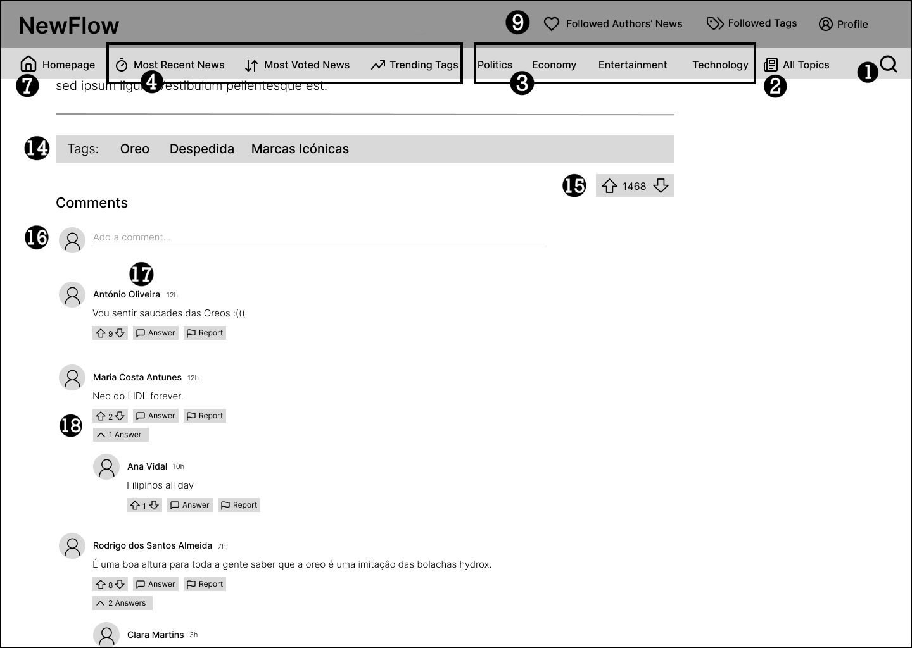

# ER: Requirements Specification Component

- **Project vision:** \
  NewFlow is a news platform that connects authors and readers, making relevant information accessible in FEUP. We aim to create a community-driven space for sharing and engaging with news, prioritizing accuracy and transparency.

## A1: NewFlow

- **Goals, business context, environment and main features**

The NewFlow is a news website created by a small-sized developer team in FEUP, whose aim is to make relevant information accessible to both students and the working body in a web format. In other words, NewFlow intends to target upcoming and experienced journalists to share their reports with the overall community.

In summary, the website not only defines a means to cycle through numerous news for any user - guest or otherwise - but it is also possible to filter and search through different topics, authors, timelines, number of votes, tags, and more.

Beyond that, if an account is created on the website, the user can add, delete or edit their own news article, which will be shared in the Home Page. Then other authenticated members comments and vote on the article. These votes will help create the author's reputation, hence establishing an official trustworthy source. However, the 'fact-checker', a verified person who has the ability to moderate information, can disclose the news as fake. This decreases the news page visibility and removes its votes. Consequently, it is important to know that after 3 strikes, the journalist will get banned from the platform, needing to appeal to rejoin the community.

Additionally, if a person really loves a specific author's articles, or a topic, or a tag, they can follow any of them and check their news personally on each of their respective pages, which showcase personalized news feeds.

Regarding the user hierarchy, the highest class are the administrators who will manage topics, tags and trending tags, ban users when needed and unban based on their appeals and more.

In conclusion, NewFlow ensures a pleasant experience in reading, writing, exploring and navigating all the shared media. It focuses on upgrading the experience originated offline and addresses the transparency which is unobtainable in most modern news websites.

- **Motivation**

Our team is trying to build a space where users can share their stories, vote on the best reports, and engage in meaningful discussions. We're committed to quality and integrity, with fact-checkers ensuring that accuracy prevails. Our system not only promotes transparency but also encourages growth and accountability within our community.

- **User profiles**

Users of NewFlow include a diverse group of individuals engaged in journalism and news consumption. Emerging journalists use the platform to share their work, gain exposure, and connect with an audience. Experienced journalists also contribute, seeking to engage with the community and receive feedback on their articles.

Readers looking for varied perspectives on current events frequent the site, using the voting and commenting features to interact with content and authors. Some users appreciate the ability to follow specific journalists, allowing them to curate their news feed according to their interests.

Overall, NewFlow attracts users who value transparency, collaboration, and a dynamic approach to news sharing.

## A2: Actors and User stories

This Artifact will contain specifications about the people that are going to use NewFlow in any way and how they are going to use it with a format of Actors and User stories. This helps document the project in a simpler and faster way.

### 2.1 Actors

NewFlow's actors and their respective descriptions are documented below.

Figure 1: NewFlow actors

| Identifier         | Description                                                                                                                      |
| ------------------ | -------------------------------------------------------------------------------------------------------------------------------- |
| User               | Generic user that has access to public information, such as news and comments as well as search and filter requests              |
| Guest              | Unauthenticated user that can register itself (sign-up), login or request to recover their password                              |
| Authenticated User | Authenticated user that can write news and comments as well as upvote or downvote other users' articles and comments             |
| News Author        | Author of a news article with the ability to edit or delete it and receive notifications about comments and upvotes/downvotes    |
| Comment Author     | Author of a comment with the ability to edit or delete it and receive notifications about replies and upvotes/downvotes          |
| Fact Checker       | Trusted user with a high reputation that can flag a news article for fake news and warn other users                              |
| Admin              | Administrator that will moderate the website by banning/unbanning users, deleting news and comments and appointing fact checkers |

Table 1: NewFlow actors description

### 2.2 User Stories

The user stories for each NewFlow actor are detailed in the following sections.

#### 2.2.1 User

<table>
<tr>
<td>

**Identifier**

</td>
<td>

**Name**

</td>
<td>

**Priority**

</td>
<td>

**Responsible**

</td>
<td>

**Description**

</td>
</tr>
<tr>
<td>US01</td>
<td>View News Item</td>
<td>High</td>
<td>---</td>
<td>As a User, I want to view news items, so that I can read an article in full.</td>
</tr>
<tr>
<td>US02</td>
<td>View Top News Feed</td>
<td>High</td>
<td>---</td>
<td>As a User, I want to view the top voted news, so that I can understand what are the most trending news reports.</td>
</tr>
<tr>
<td>US03</td>
<td>Search for News Items and Comments</td>
<td>High</td>
<td>---</td>
<td>As a User, I want to search for news and comments, so that I can access the information I'm looking for easier.</td>
</tr>
<tr>
<td>US04</td>
<td>Exact Match Search</td>
<td>High</td>
<td>---</td>
<td>As a User, I want to search with an exact-match, so that I obtain news articles with titles matching my search.</td>
</tr>
<tr>
<td>US05</td>
<td>Full-text Search</td>
<td>High</td>
<td>---</td>
<td>As a User, I want to search in full-text, so that I obtain news articles with content matching my search.</td>
</tr>

<tr>
<td>US06</td>
<td>View News Item Details</td>
<td>High</td>
<td>---</td>
<td>As a User, I want to view the details of any particular article, so that I can see extra information about each news.</td>
</tr>

<tr>
<td>US07</td>
<td>View Comment Details</td>
<td>High</td>
<td>---</td>
<td>As a User, I want to view the details of any particular comment, so that I can see extra information about each comment.</td>
</tr>

<tr>
<td>US08</td>
<td>Home page feed</td>
<td>High</td>
<td>---</td>
<td>As a User, I I want to see a News Feed as soon as I enter the website, so that I can explore news articles as soon as I enter without having to search for them.</td>
</tr>

<tr>
<td>US09</td>
<td>Search over Multiple Attributes</td>
<td>Medium</td>
<td>---</td>
<td>As a User, I want to search over multiple attributes (author, title, etc.), so that I can be even more precise while searching for news.</td>
</tr>
<tr>
<td>US10</td>
<td>Search by Filters</td>
<td>Medium</td>
<td>---</td>
<td>As a User, I want to search by filters, so that I can narrow my search even further.</td>
</tr>
<tr>
<td>US11</td>
<td>View Recent News Feed</td>
<td>Medium</td>
<td>---</td>
<td>As a User, I want to view the most recent news, so that I'm aware of the latest events.</td>
</tr>
<tr>
<td>US12</td>
<td>View News Item Comments</td>
<td>Medium</td>
<td>---</td>
<td>As a User, I want to view news articles' comments, so that I can understand different perspectives about a subject.</td>
</tr>
<tr>
<td>US13</td>
<td>View Placeholders in Form Inputs</td>
<td>Medium</td>
<td>---</td>
<td>As a User, I want to view placeholders in form inputs, so that I have an example of what I need to type.</td>
</tr>
<tr>
<td>US14</td>
<td>View Contextual Error Messages</td>
<td>Medium</td>
<td>---</td>
<td>As a User, I want to view Contextual Error Messages, so that I can understand what is wrong with my input and the platform's activity.</td>
</tr>
<tr>
<td>US15</td>
<td>View the "About Us" Page</td>
<td>Medium</td>
<td>---</td>
<td>As a User, I want to view the "About Us" page, so that I can learn more about the platform origins, goals and objectives.</td>
</tr>
<tr>
<td>US16</td>
<td>View the "Main Features" Page</td>
<td>Medium</td>
<td>---</td>
<td>As a User, I want to view the "Main Features" page, so that I can understand the platform capabilities and interact with it the right way.</td>
</tr>
<tr>
<td>US17</td>
<td>View the "Platform Contacts" Page</td>
<td>Medium</td>
<td>---</td>
<td>As a User, I want to view the "Platform Contacts" page, so that I can contact the right entities about my interests in the platform.</td>
</tr>

<tr>
<td>US18</td>
<td>View Other Users' Profiles</td>
<td>Medium</td>
<td>---</td>
<td>As a User, I want to view other users' profiles, so that I access more information about people in the website.</td>
</tr>

<tr>
<td>US19</td>
<td>View Reputation of Other Users</td>
<td>Medium</td>
<td>---</td>
<td>As a User, I want to view other users' reputation so that I know who I can trust and can't.</td>
</tr>

<tr>
<td>US20</td>
<td>View News Items Tags</td>
<td>Medium</td>
<td>---</td>
<td>As a User, I want to view the tags of a news article, so that I can know before reading what the news are about.</td>
</tr>

<tr>
<td>US21</td>
<td>Newspaper-like reading mode</td>
<td>Low</td>
<td>---</td>
<td>As a User, I want to see the articles in a newspaper-like reading formula, so that I prevent unnecessary scrolling.</td>
</tr>

<tr>
</table>

Table 2: User Stories for the User

#### 2.2.2 Guest

<table>
<tr>
<td>

**Identifier**

</td>
<td>

**Name**

</td>
<td>

**Priority**

</td>
<td>

**Responsible**

</td>
<td>

**Description**

</td>
</tr>

<tr>
<td>US22</td>
<td>Sign-In</td>
<td>High</td>
<td>---</td>
<td>As a Guest, I want to sign into the system, so that I can access my account.</td>
</tr>

<tr>
<td>US23</td>
<td>Registration</td>
<td>High</td>
<td>---</td>
<td>As a Guest, I want to register into the system, so that I can get access to comment or create my own articles.</td>
</tr>

<tr>
<td>US24</td>
<td>Recover Password</td>
<td>Medium</td>
<td>---</td>
<td>As a Guest, I want to be able to recover my password, so that I can access my account again in case I forget it.</td>
</tr>

<tr>
</table>

Table 3: User Stories for the Guest

#### 2.2.3 Authenticated User

<table>
<tr>
<td>

**Identifier**

</td>
<td>

**Name**

</td>
<td>

**Priority**

</td>
<td>

**Responsible**

</td>
<td>

**Description**

</td>
</tr>

<tr>
<td>US25</td>
<td>Logout</td>
<td>High</td>
<td>---</td>
<td>As an Authenticated User, I want to log out from my account, so that my account details are secure.</td>
</tr>

<tr>
<td>US26</td>
<td>Change Password</td>
<td>High</td>
<td>---</td>
<td>As an Authenticated User, I want to change my password, so that my account is safe from potential threats.</td>
</tr>

<tr>
<td>US27</td>
<td>View Personal Profile</td>
<td>High</td>
<td>---</td>
<td>As an Authenticated User, I want to view my profile, so that I can check what info is connected to my account.</td>
</tr>

<tr>
<td>US28</td>
<td>Edit Profile</td>
<td>High</td>
<td>---</td>
<td>As an Authenticated User, I want to edit my profile, so that I can rectify any mistake or update my information.</td>
</tr>

<tr>
<td>US29</td>
<td>View User News Feed</td>
<td>High</td>
<td>---</td>
<td>As an Authenticated User, I want to view my own customizable News Feeds (Following authors, topics and tags), so that I can read news about topics/tags and created by authors I enjoy.</td>
</tr>

<tr>
<td>US30</td>
<td>Create News Item</td>
<td>High</td>
<td>---</td>
<td>As an Authenticated User, I want to create new articles, so that I may be able to contribute to this website.</td>
</tr>

<tr>
<td>US31</td>
<td>Delete Account</td>
<td>Medium</td>
<td>---</td>
<td>As an Authenticated User, I want to delete my account, so that nobody usurps my account data.</td>
</tr>

<tr>
<td>US32</td>
<td>Change Profile Picture</td>
<td>Medium</td>
<td>---</td>
<td>As an Authenticated User, I want to have a profile picture, so that I can personalize my account.</td>
</tr>

<tr>
<td>US33</td>
<td>View Personal Notifications</td>
<td>Medium</td>
<td>---</td>
<td>As an Authenticated User, I want to view personal notifications, so that I can check who comments or likes my content.</td>
</tr>

<tr>
<td>US34</td>
<td>Vote on News Item (Positively, or Negatively)</td>
<td>Medium</td>
<td>---</td>
<td>As an Authenticated User, I want to vote on any article, so that I may be able to show my opinion about those specific news.</td>
</tr>

<tr>
<td>US35</td>
<td>Vote on Comment (create, change, remove)</td>
<td>Medium</td>
<td>---</td>
<td>As an Authenticated User, I want to vote on other users' comments, so that I may be able to show my opinion about that specific comment.</td>
</tr>

<tr>
<td>US36</td>
<td>Comment on News Item</td>
<td>Medium</td>
<td>---</td>
<td>As an Authenticated User, I want to comment on any article, so that I may be able to show my opinion about those specific news.</td>
</tr>

<tr>
<td>US37</td>
<td>Follow Users</td>
<td>Medium</td>
<td>---</td>
<td>As an Authenticated User, I want to follow Users, so that I can read more news from journalists I like without searching their name.</td>
</tr>

<tr>
<td>US38</td>
<td>Unfollow Users</td>
<td>Medium</td>
<td>---</td>
<td>As an Authenticated User, I want to unfollow Users, so that I don't have to see users content I'm not interested anymore.</td>
</tr>

<tr>
<td>US39</td>
<td>Follow/Unfollow Tags/Topics</td>
<td>Medium</td>
<td>---</td>
<td>As an Authenticated User, I want to be able to follow and unfollow tags/topics so that they match my current news' interests.</td>
</tr>

<tr>
<td>US40</td>
<td>Propose New Tag</td>
<td>Medium</td>
<td>---</td>
<td>As an Authenticated User, I want to be able to propose a new tag, so that news articles can be more accurately catalogued.</td>
</tr>

<tr>
<td>US41</td>
<td>Add News Item to Favorites</td>
<td>Medium</td>
<td>---</td>
<td>As an Authenticated User, I want to add News Item to Favorites, so that I can save news I like for later reading.</td>
</tr>

<tr>
<td>US42</td>
<td>Remove News Item from Favorites</td>
<td>Medium</td>
<td>---</td>
<td>As an Authenticated User, I want to remove News Item from Favorites, so that I can remove news that I lost interest in.</td>
</tr>

<tr>
<td>US43</td>
<td>Report Content (news items)</td>
<td>Medium</td>
<td>---</td>
<td>As an Authenticated User, I want to report content, so that can I help in maintaining order on the platform.</td>
</tr>

<tr>
<td>US44</td>
<td>Report Users (comments)</td>
<td>Medium</td>
<td>---</td>
<td>As an Authenticated User, I want to report users, so that the platform is cleared of any misconduct.</td>
</tr>

<tr>
<td>US45</td>
<td>Appeal for Unban</td>
<td>Low</td>
<td>---</td>
<td>As an Authenticated User, I want to appeal for unban, so that I can rejoin the platform in case my ban was unjust.</td>
</tr>

<tr>
<td>US46</td>
<td>Can ask for a fact-check</td>
<td>Low</td>
<td>---</td>
<td>As an Authenticated User, I want to be able ask for a certain news article to be fact-checked, so that I can alert fact-checkers of a possible fake news.</td>
</tr>

<tr>
<td>US47</td>
<td>Can ask to become a fact checker</td>
<td>Low</td>
<td>---</td>
<td>As an Authenticated User, I want to be able to ask to become a fact-checker, so that I may contribute in the fight against fake news.</td>
</tr>

<tr>
</table>

Table 4: User Stories for the Authenticated User

#### 2.2.4 News Author

<table>
<tr>
<td>

**Identifier**

</td>
<td>

**Name**

</td>
<td>

**Priority**

</td>
<td>

**Responsible**

</td>
<td>

**Description**

</td>
</tr>

<tr>
<td>US48</td>
<td>Edit News Item</td>
<td>High</td>
<td>---</td>
<td>As a News Author, I want to edit my news, so that my content is always updated.</td>
</tr>

<tr>
<td>US49</td>
<td>Delete News Item</td>
<td>High</td>
<td>---</td>
<td>As a News Author, I want to delete my news, so that its content is not available in the system.</td>
</tr>

<tr>
</table>

Table 5: User Stories for the News Author

#### 2.2.5 Comment Author

<table>
<tr>
<td>

**Identifier**

</td>
<td>

**Name**

</td>
<td>

**Priority**

</td>
<td>

**Responsible**

</td>
<td>

**Description**

</td>
</tr>

<tr>
<td>US50</td>
<td>Edit Comment</td>
<td>Medium</td>
<td>---</td>
<td>As a Comment Author, I want to edit my comments, so that I can correct it, or add more information.</td>
</tr>

<tr>
<td>US51</td>
<td>Delete Comment</td>
<td>Medium</td>
<td>---</td>
<td>As a Comment Author, I want to delete my comments, so that no one can see when I post something wrong, or that I regret.</td>
</tr>

<tr>
</table>

Table 6: User Stories for the Comment Author

#### 2.2.6 Admin

<table>
<tr>
<td>

**Identifier**

</td>
<td>

**Name**

</td>
<td>

**Priority**

</td>
<td>

**Responsible**

</td>
<td>

**Description**

</td>
</tr>

<tr>
<td>US52</td>
<td>Administer User Accounts (search, view, edit, create)</td>
<td>High</td>
<td>---</td>
<td>As an Admin, I want to administer user accounts, so that I can maintain the integrity of the platform.</td>
</tr>

<tr>
<td>US53</td>
<td>Ban and Unban User Accounts</td>
<td>Medium</td>
<td>---</td>
<td>As an Admin, I want to ban or unban, so that users don't behave inappropriately.</td>
</tr>

<tr>
<td>US54</td>
<td>Delete User Account</td>
<td>Medium</td>
<td>---</td>
<td>As an Admin, I want to delete a user account, so that users who engage in inappropriate behavior face the consequences.</td>
</tr>

<tr>
<td>US55</td>
<td>Manage Tag Proposals</td>
<td>Medium</td>
<td>---</td>
<td>As an Admin, I want to manage tag proposals, so that the site can increase the variety of articles.</td>
</tr>

<tr>
<td>US56</td>
<td>Manage Content and User Reports</td>
<td>Medium</td>
<td>---</td>
<td>As an Admin, I want to manage content and user reports, so that everything shown in the platform is appropriate.</td>
</tr>

<tr>
<td>US57</td>
<td>Can manage the attributes of the attribute search</td>
<td>Low</td>
<td>---</td>
<td>As an Admin, I want to add new attributes, so that new authors and articles can be quickly found through the search bar.</td>
</tr>

<tr>
<td>US58</td>
<td>Can manage of the trending tags</td>
<td>Low</td>
<td>---</td>
<td>As an Admin, I want to select daily which matters are more popular, so that users of the website can discuss them.</td>
</tr>

<tr>
<td>US59</td>
<td>Can promote the users to "fact checkers"</td>
<td>Low</td>
<td>---</td>
<td>As an Admin, I want to promote users to Fact Checkers, so that they help keep the platform.</td>
</tr>

<tr>
</table>

Table 7: User Stories for the Admin

#### 2.2.7 Fact Checker

<table>
<tr>
<td>

**Identifier**

</td>
<td>

**Name**

</td>
<td>

**Priority**

</td>
<td>

**Responsible**

</td>
<td>

**Description**

</td>
</tr>

<tr>
<td>US60</td>
<td>Ability to fact check articles</td>
<td>Low</td>
<td>---</td>
<td>As a Fact Checker, I want to be able to warn other users about the veracity of an article by giving it a badge(true, false) and writing a highlighted comment with my sources, so that I can warn users of fake news.</td>
</tr>

<tr>
<td>US61</td>
<td>Can check the articles more flagged with potential fake news</td>
<td>Low</td>
<td>---</td>
<td>As a Fact Checker, I want to be able to filter my feed in order to see the most flagged articles, so that I don't have to search for those articles myself.</td>
</tr>

<tr>
</table>

Table 8: User Stories for the Fact Checker

### 2.3 Supplementary Requirements

#### 2.3.1 Business rules

<table>
<tr>
<td>

**Identifier**

</td>
<td>

**Name**

</td>
<td>

**Description**

</td>
</tr>

<tr>
<td>BR1</td>
<td>Deleted accounts</td>
<td>Upon account deletion, shared user data (e.g. comments, likes, dislikes) is kept but is made anonymous.</td>
</tr>

<tr>
<td>BR2</td>
<td>User Reputation</td>
<td>Users will have a reputation associated with them, which will be a number between 0 (lowest) and 5 (highest). This value will increase periodically when a user hasn't committed any misconduct or has received high praise for recent posts, and it will decrease when a user commits any misconduct.</td>
</tr>

<tr>
<td>BR3</td>
<td>Record Keeping</td>
<td>A post or comment cannot be deleted by its author if it has votes or comments. Instead, if a user wishes to delete a comment, its content will be set to "This article/comment has been deleted by the user", the author will be set to anonymous and the user will lose edit privileges.</td>
</tr>

<tr>
<td>BR4</td>
<td>Fake Article</td>
<td>A news article that contains purposefully false information will have its visibility reduced.</td>
</tr>

<tr>
<td>BR5</td>
<td>Account Ban Policy</td>
<td>If a user commits any misconduct when having a reputation of 0, they will be banned and need to appeal if they want their account back.</td>
</tr>

<tr>
<td>BR6</td>
<td>Interacting With Own Publications</td>
<td>An authenticated user can reply/vote on their own posts/comments.</td>
</tr>

<tr>
<td>BR7</td>
<td>Delete User</td>
<td>When a user wishes to delete their account, all the personal information will be set to "deleted" but the user will remain in the database to retain all their interactions with the system. Their posts will have the author be considered anonymous.</td>
</tr>

<tr>
<td>BR8</td>
<td>Special Characters</td>
<td>Some input fields such as username will not allow the user to input special characters.</td>
</tr>

<tr>
<td>BR9</td>
<td>Edit Date</td>
<td>The edit date for an article or comment will always be greater than the creation date for said post (editDate > createDate).</td>
</tr>

<tr>
<td>BR10</td>
<td>Maximum Number of Characters</td>
<td>All input fields will not be able to pass a certain number of characters (ex.: username length <= 20).</td>
</tr>

<tr>
<td>BR11</td>
<td>Follow Restriction</td>
<td>A user cannot follow themselves.</td>
</tr>

<tr>
<td>BR12</td>
<td>Vote Restrictions</td>
<td>A user can only have up to one vote per post and that vote can either be an upvote or a downvote.</td>
</tr>

<tr>
</table>

Table 9: NewFlow Business Rules

#### 2.3.2 Technical requirements

<table>
<tr>
<td>

**Identifier**

</td>
<td>

**Name**

</td>
<td>

**Description**

</td>
</tr>

<tr>
<td>TR1</td>
<td>Performance</td>
<td>The system should have response times shorter than 2s to ensure the user's attention.</td>
</tr>

<tr>
<td>TR2</td>
<td>Robustness</td>
<td>The system must be prepared to handle and continue operating when runtime errors occur.</td>
</tr>

<tr>
<td>TR3</td>
<td>Scalability</td>
<td>The system must be prepared to deal with the growth in the number of users and their actions.</td>
</tr>

<tr>
<td>TR4</td>
<td>Accessibility</td>
<td>The system must ensure that everyone can access the pages, regardless of whether they have any handicap or not, or the Web browser they use.</td>
</tr>

<tr>
<td>TR5</td>
<td>Availability</td>
<td>The system must be available for 99 percent of every 24 hours.</td>
</tr>

<tr>
<td>TR6</td>
<td>Usability</td>
<td>The system should be easy to use and traverse.</td>
</tr>

<tr>
<td>TR7</td>
<td>Security</td>
<td>The system must protect sensitive user's information from unauthorized access through the authentication process.</td>
</tr>

<tr>
<td>TR8</td>
<td>Database</td>
<td>The system must store data in a non-redundant, relational PostgreSQL database.</td>
</tr>

<tr>
</table>

Table 10: NewFlow Technical requirements

Our group decided that from this list of requirements it would be important to highlight the Accessibility and Security especially, as they are the backbone of every website and our top priority should always be to make the user feel safe and that our design is intuitive. Besides that, we believe that Scalability should also be one of our main concerns to ensure that our website is prepared to handle a high volume of both new articles and users.

#### 2.3.3 Restrictions

<table>
<tr>
<td>

**Identifier**

</td>
<td>

**Name**

</td>
<td>

**Description**

</td>
</tr>

<tr>
<td>R01</td>
<td>Deadline</td>
<td>The system must by ready be the end of the 1st semester.</td>
</tr>

<tr>
</table>
Table 11: NewFlow Restrictions

## A3: Information Architecture

This section will focus on the organization and structuring of NewFlow's main pages and the connection between them. For this purpose we will use a sitemap to show how different pages link with one another and wireframes to give a visual representation of how our website will look like.

### 3.1 Sitemap

Figure 2: NewFlow SiteMap

### 3.2 Wireframes

Our group decided that the best pages to represent NewFlow are the home and article page as they are the pages where the user will spend most of their time as well as being the foundation of this project therefore choosing them for the wireframes present in this section.

#### UI01: Home Page

Figure 3: NewFlow Home Page as a Wireframes

1. Access to the search feature
2. Dropdown menu with all the topics available
3. Direct access to some topics
4. Buttons to reach pages with filtered and ordered articles by time of upload, number of votes or tags
5. Zone to peruse the top 5 trending tags
6. Zone to inspect the most recent news articles
7. Direct navigation to the home page
8. Article zone which links to the related article page
9. Links redirecting to personal and customizable content such as "Followed Authors' News", "Followed Tags" and "Profile" respectively

#### UI02 Article Page

Figure 4, 5, 6 and 7: NewFlow Article Page divided into Wireflows (introduction, content, comments and 'More news by', respectively)

10. Breadcrumbs to help the user navigate
11. Button to report the article as fake; owner of the post have options to edit or delete post
12. Link to the author's profile page
13. Button to follow the author of the article
14. Links to the relevant tags' pages of the article
15. Buttons to upvote and downvote
16. Option to user add its own comment under the article
17. Link to the comment owner profile
18. Buttons to interact with comment: upvote/downvote comment, answer or report comment, and drop menu to explore users answers
19. Zone with article links made by the same author
20. Links to reach pages with help and information about the developers and the website

---

## Revision history

16-10-2024:

- Changed US39 to also include topics

29-10-2024:

- Changed the sitemap to include Search Page
- Changed business rules: BR2, BR3 and BR5
- Added new business rules: BR7-BR10

04-11-2024:

- Added new business rules: BR11 and BR12

## GROUP24124, 07/10/2024

- Gabriel Carvalho, up202208939@up.pt (Editor)
- Guilherme Silva, up202205298@up.pt
- Valentina Cadime, up202206262@up.pt
- Vasco Melo, up202207564@up.pt
