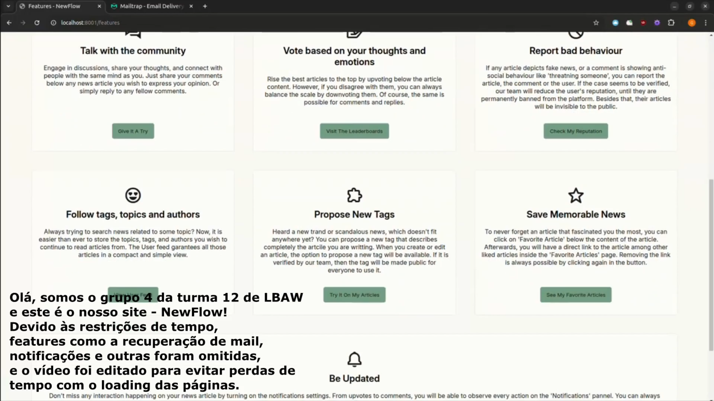

# PA: Product and Presentation

NewFlow is a news product that connects authors and readers, making relevant information accessible in FEUP. We aim to create a community-driven space for sharing and engaging with news, prioritizing accuracy and transparency.

## A9: Product

The NewFlow platform is the culmination of a carefully designed information system, developed through stages A1 to A9. Built using PHP and the Laravel Framework for dynamic web page generation, it integrates AJAX for improved user interaction, with PostgreSQL serving as the backend database.

Developed by a small team at FEUP, NewFlow is a news website designed to provide valuable information in a digital format for both students and professionals. The platform aims to create a space where both emerging and experienced journalists can share their reports, fostering a connection with the wider community.

In essence, NewFlow is not just a news aggregator. It allows users, whether guests or registered members, to easily browse through a variety of news articles. Additionally, the site offers advanced filtering options, enabling users to search by topics, authors, timelines, votes, tags, and more.

### 1. Installation

The release with the final version of the source code in the group's Git repository is available here, in PA tag.

The Docker commands to get and launch the image available in the group's GitLab Container Registry using the production database are as follows:

```
docker pull gitlab.up.pt:5050/lbaw/lbaw2425/lbaw24124:latest
docker run -d --name lbaw24124 -p 8001:80 gitlab.up.pt:5050/lbaw/lbaw2425/lbaw24124:latest
```

The application will be available at: http://localhost:8001/

### 2. Usage

#### 2.1. Administration Credentials

The final product is available online (colocar qualquer URL).

| Username | Email             | Password    |
| -------- | ----------------- | ----------- |
| notAdmin | admin@example.com | password123 |

#### 2.2. User Credentials

| Type           | Username | Email               | Password    |
| -------------- | -------- | ------------------- | ----------- |
| basic account  | alicej   | alice@example.com   | password123 |
| banned account | miguelS  | miguels@example.com | password123 |

#### 2.3. Mail Trap Credentials

| Email               | Password    |
| ------------------- | ----------- |
| lbaw24124@gmail.com | odeioWebDev |

### 3. Application Help

Although NewFlow displays an effortless and simple design, it lacks on secondary help menus and Q&A forums. However, description of the content and placeholders inside inputs provide sufficient information to help users navigate.

In addition, the Features page, located inside the footer, provide all the developed features on the platform, helping them to understand the contents and navigate them to the functionalities of the website.

Finally, users can contact the team by the Contacts page, if additional help or information is necessary or requested.

### 4. Input Validation

Input data from the forms was validated using the appropriate HTML attributes (e.g. required, value, min, max) and JavaScript functions on the clientside:

The following code snippet is the verification done for AJAX requests done in the Administrator Panel (creating a new user, creating a new tag, and creating a new topic):

```javascript
function validateForm(formData, entityType) {
  let isValid;

  switch (entityType) {
    case "user":
      isValid = validateUserForm(formData);
      break;
    case "topic":
      isValid = validateTopicForm(formData);
      break;
    case "tag":
      isValid = validateTagForm(formData);
      break;
    default:
      console.error(`Unknown entity type: ${entityType}`);
      isValid = false;
  }

  return isValid;
}

function validateUserForm(formData) {
  const username = formData.get("username").trim();
  const displayName = formData.get("display_name").trim();
  const email = formData.get("email").trim();
  const password = formData.get("password").trim();

  const usernameRegex = /^[a-zA-Z0-9_-]+$/;
  const displayNameRegex = /^[a-zA-Z0-9 _-]+$/;
  const emailRegex = /^[a-zA-Z0-9._%+-]+@[a-zA-Z0-9.-]+\.[a-zA-Z]{2,}$/;

  if (username.length < 3 || username.length > 20) {
    alert("Username must be between 3 and 20 characters.");
    return false;
  }
  if (!usernameRegex.test(username)) {
    alert(
      "Username should only contain letters, numbers, dashes, and underscores."
    );
    return false;
  }

  if (displayName.length < 3 || displayName.length > 20) {
    alert("Display name must be between 3 and 20 characters.");
  }
  if (!displayNameRegex.test(displayName)) {
    alert(
      "Display Name should only contain letters, numbers, spaces, dashes, and underscores."
    );
    return false;
  }

  if (!emailRegex.test(email)) {
    alert("Please provide a valid email address.");
    return false;
  }

  if (password.length < 8) {
    alert("Password must be at least 8 characters long.");
    return false;
  }

  return true;
}
function validateTopicForm(formData) {
  const topicName = formData.get("name").trim();

  if (topicName === "") {
    alert("Topic name is required.");
    return false;
  }

  if (topicName.length > 30) {
    alert("Topic name must not exceed 30 characters.");
    return false;
  }

  return true;
}
function validateTagForm(formData) {
  const tagName = formData.get("name").trim();

  if (tagName === "") {
    alert("Tag name is required.");
    return false;
  }

  if (tagName.length > 30) {
    alert("Tag name must not exceed 30 characters.");
    return false;
  }

  return true;
}
```

Due to the relatively easy circumvention of clientside validation, we also implemented serverside validation using Laravel's built-in validation system. This system allows us to define rules for each input field, which are then checked when the form is submitted. If any of the rules are violated, the action is not allowed, and the user is redirected back with an error message:

The following code snippet is from the `register()` method in the `RegisterController` class.

```php
$request->validate([
  'username' => 'required|string|regex:/^[a-zA-Z0-9._-]+$/|max:20|unique:users',
  'email' => 'required|string|email|max:256|unique:users',
  'password' => 'required|string|min:8|confirmed',
]);
```

Another example, that contains a more complex validation rule and a more specific return is in the `createFullUser()` method of the `AdminPanelController` class. As it is an AJAX request, the return is a JSON object with the success status and the errors found (it is the serverside validation of the forms that go through the JavaScript validation above):

```php
$validator = Validator::make($request->all(), [
    'username' => 'required|string|regex:/^[a-zA-Z0-9._-]+$/|max:20|unique:users',
    'email' => 'required|string|email|max:256|unique:users',
    'display_name' => 'nullable|string|max:20',
    'description' => 'nullable|string|max:300',
    'password' => 'required|string|min:8|max:256',
    'profile_picture' => 'nullable|image|mimes:jpeg,png,jpg,gif,svg|max:2048',
    'reputation' => 'nullable|integer|min:0|max:5',
    'upvote_notification' => 'nullable|boolean',
    'comment_notification' => 'nullable|boolean',
    'is_admin' => 'nullable|boolean',
    'is_fact_checker' => 'nullable|boolean',
]);
if ($validator->fails()) {
    return response()->json([
        'success' => false,
        'errors' => $validator->errors(),
    ], 422);
}
```

### 5. Check Accessibility and Usability

In the following links, you can find the results of the provided accessibility and usability tests in a PDF format in the group's repository:

[Accessibility Report](https://gitlab.up.pt/lbaw/lbaw2425/lbaw24124/-/blob/Product/docs/validation/checklist_acessibilidade.pdf)

[Usability Report](https://gitlab.up.pt/lbaw/lbaw2425/lbaw24124/-/blob/Product/docs/validation/checklist_usability.pdf)

### 6. HTML & CSS Validation

In the following links, you can find the results of using the provided [HTML](https://validator.w3.org/nu/) and [CSS](https://jigsaw.w3.org/css-validator/) validation tools in the central page of our product - Homepage - in a PDF format in the group's repository:

[HTML Validation](https://gitlab.up.pt/lbaw/lbaw2425/lbaw24124/-/blob/Product/docs/validation/homepage_html.pdf)

CSS Sheets:

- [Validation - app.css](https://gitlab.up.pt/lbaw/lbaw2425/lbaw24124/-/blob/Product/docs/validation/app_css.pdf)
- [Validation - article_page.css](https://gitlab.up.pt/lbaw/lbaw2425/lbaw24124/-/blob/Product/docs/validation/article_page_css.pdf)
- [Validation - footer.css](https://gitlab.up.pt/lbaw/lbaw2425/lbaw24124/-/blob/Product/docs/validation/footer_css.pdf)
- [Validation - header.css](https://gitlab.up.pt/lbaw/lbaw2425/lbaw24124/-/blob/Product/docs/validation/header_css.pdf)
- [Validation - trending_tag.css](https://gitlab.up.pt/lbaw/lbaw2425/lbaw24124/-/blob/Product/docs/validation/header_css.pdf)

### 7. Revisions to the Project

Revisions made in ER:

- In US39, the ability to also follow topics wasn't specified, even though that was the intention. So that part was added.
- The Search page wasn't initially present in the sitemap, as it should.
- BR2, BR3 and BR5 were changed to better explain the features they are referring to
- Added BR7 to BR12 to specify behaviors that are common in this type of website.

Revisions made in EBD:

- The SQL table names were changed from PascalCase to snake_case to avoid ambiguity with Laravel default naming schemes.

- The populate.sql file was also improved to provide more useful examples when testing

Revisions made in EAP:

- The title of the M05 section of the Open API Specification was changed to better reflect the features described there.

### 8. Implementation Details

#### 8.1. Libraries Used

- [Laravel](https://laravel.com/), for server-side management

#### 8.2 User Stories

| US Identifier | Name                                                  | Module | Priority | Team Members                                                        | State |
| ------------- | ----------------------------------------------------- | ------ | -------- | ------------------------------------------------------------------- | ----- |
| US22          | Sign-In                                               | M01    | High     | **Vasco Melo**, Valentina Cadime, Guilherme Silva, Gabriel Carvalho | 100%  |
| US23          | Registration                                          | M01    | High     | **Vasco Melo**, Valentina Cadime, Guilherme Silva                   | 100%  |
| US25          | Logout                                                | M01    | High     | **Vasco Melo**, Valentina Cadime, Guilherme Silva                   | 100%  |
| US08          | Home page feed                                        | M03    | High     | **Valentina Cadime**                                                | 100%  |
| US01          | View News Item                                        | M03    | High     | **Vasco Melo**, Valentina Cadime, Guilherme Silva                   | 100%  |
| US06          | View News Item Details                                | M03    | High     | **Vasco Melo**, Valentina Cadime                                    | 100%  |
| US07          | View Comment Details                                  | M03    | High     | **Vasco Melo**, Valentina Cadime                                    | 100%  |
| US15          | View the “About Us” Page                              | M09    | Medium   | **Valentina Cadime**                                                | 100%  |
| US17          | View the "Platform Contacts" Page                     | M09    | Medium   | **Valentina Cadime**                                                | 100%  |
| US20          | View News Items Tags                                  | M03    | Medium   | **Vasco Melo**, Valentina Cadime                                    | 100%  |
| US27          | View Personal Profile                                 | M02    | High     | **Vasco Melo**, Gabriel Carvalho, Valentina Cadime, Guilherme Silva | 100%  |
| US28          | Edit Profile                                          | M02    | High     | **Gabriel Carvalho**, Vasco Melo, Valentina Cadime, Guilherme Silva | 100%  |
| US26          | Change Password                                       | M01    | High     | **Gabriel Carvalho**, Guilherme Silva                               | 100%  |
| US32          | Change Profile Picture                                | M02    | Medium   | **Gabriel Carvalho**                                                | 100%  |
| US04          | Exact Match Search                                    | M04    | High     | **Vasco Melo**, Valentina Cadime, Guilherme Silva                   | 100%  |
| US03          | Search for News Items and Comments                    | M04    | High     | **Vasco Melo**, Valentina Cadime, Guilherme Silva                   | 100%  |
| US05          | Full-text Search                                      | M04    | High     | **Vasco Melo**, Valentina Cadime, Guilherme Silva                   | 100%  |
| US10          | Search by Filters                                     | M04    | Medium   | **Vasco Melo**, Valentina Cadime, Guilherme Silva                   | 100%  |
| US09          | Search over Multiple Attributes                       | M04    | Medium   | **Vasco Melo**, Valentina Cadime, Guilherme Silva                   | 100%  |
| US11          | View Recent News Feed                                 | M03    | Medium   | **Valentina Cadime**                                                | 100%  |
| US12          | View News Item Comments                               | M03    | Medium   | **Vasco Melo**, Valentina Cadime                                    | 100%  |
| US16          | View the "Main Features" Page                         | M09    | Medium   | **Valentina Cadime**                                                | 100%  |
| US30          | Create News Item                                      | M03    | High     | **Vasco Melo**, Valentina Cadime, Guilherme Silva                   | 100%  |
| US31          | Delete Account                                        | M02    | Medium   | **Gabriel Carvalho**, Guilherme Silva                               | 100%  |
| US48          | Edit News Item                                        | M03    | High     | **Vasco Melo**, Gabriel Carvalho, Valentina Cadime, Guilherme Silva | 100%  |
| US49          | Delete News Item                                      | M03    | High     | **Vasco Melo**, Valentina Cadime, Guilherme Silva                   | 100%  |
| US37          | Follow Users                                          | M02    | Medium   | **Vasco Melo**, Valentina Cadime, Guilherme Silva                   | 100%  |
| US38          | Unfollow Users                                        | M02    | Medium   | **Vasco Melo**, Valentina Cadime, Guilherme Silva                   | 100%  |
| US39          | Follow/Unfollow Tags/Topics                           | M05    | Medium   | **Valentina Cadime**, Vasco Melo, Guilherme Silva                   | 100%  |
| US29          | View User News Feed                                   | M03    | High     | **Valentina Cadime**, Vasco Melo, Guilherme Silva                   | 100%  |
| US52          | Administer User Accounts (search, view, edit, create) | M09    | High     | **Guilherme Silva**, Valentina Cadime                               | 100%  |
| US02          | View Top News Feed                                    | M03    | High     | **Valentina Cadime**, Vasco Melo                                    | 100%  |
| US13          | View Placeholders in Form Inputs                      | -      | Medium   | **Guilherme Silva**                                                 | 100%  |
| US14          | View Contextual Error Messages                        | -      | Medium   | **Guilherme Silva**                                                 | 100%  |
| US18          | View Other Users' Profiles                            | M02    | Medium   | **Valentina Cadime**, Gabriel Carvalho, Guilherme Silva, Vasco Melo | 100%  |
| US41          | Add News Item to Favorites                            | M03    | Medium   | **Vasco Melo**, Valentina Cadime, Guilherme Silva                   | 100%  |
| US42          | Remove News Item from Favorites                       | M03    | Medium   | **Vasco Melo**, Valentina Cadime, Guilherme Silva                   | 100%  |
| US34          | Vote on News Item (Positively, or Negatively)         | M07    | Medium   | **Vasco Melo**, Valentina Cadime                                    | 100%  |
| US35          | Vote on Comment (create, change, remove)              | M07    | Medium   | **Vasco Melo**, Guilherme Silva                                     | 100%  |
| US36          | Comment on News Item                                  | M07    | Medium   | **Vasco Melo**, Valentina Cadime, Guilherme Silva                   | 100%  |
| US43          | Report Content (news items)                           | M03    | Medium   | **Vasco Melo**, Valentina Cadime, Guilherme Silva                   | 100%  |
| US44          | Report Users (comments)                               | M07    | Medium   | **Vasco Melo**, Valentina Cadime, Guilherme Silva                   | 100%  |
| US50          | Edit Comment                                          | M07    | Medium   | **Vasco Melo**, Valentina Cadime, Guilherme Silva                   | 100%  |
| US51          | Delete Comment                                        | M07    | Medium   | **Vasco Melo**, Valentina Cadime, Guilherme Silva                   | 100%  |
| US24          | Recover Password                                      | M01    | Medium   | **Gabriel Carvalho**, Guilherme Silva                               | 100%  |
| US33          | View Personal Notifications                           | M02    | Medium   | **Vasco Melo**, Valentina Cadime, Guilherme Silva                   | 100%  |
| US40          | Propose New Tag                                       | M03    | Medium   | **Vasco Melo**, Guilherme Silva                                     | 100%  |
| US53          | Ban and Unban User Accounts                           | M09    | Medium   | **Guilherme Silva**, Valentina Cadime                               | 100%  |
| US54          | Delete User Account                                   | M09    | Medium   | **Guilherme Silva**, Valentina Cadime                               | 100%  |
| US55          | Manage Tag Proposals                                  | M09    | Medium   | **Guilherme Silva**, Valentina Cadime                               | 100%  |
| US56          | Manage Content and User Reports                       | M09    | Medium   | **Guilherme Silva**, Valentina Cadime                               | 100%  |
| US19          | View Reputation of Other Users                        | M02    | Medium   | **Guilherme Silva**, Valentina Cadime                               | 100%  |

---

## A10: Presentation

The last artifact encopasses the final presentation of NewFlow. It includes the demonstration of the developed features and design, and highlights the value the product brings to its target audience.

### 1. Product presentation

NewFlow is a dynamic news platform designed to connect authors and readers within the FEUP community. It provides a space for both emerging and experienced journalists to share their stories, ensuring that information is easily accessible and engaging for all users. The platform allows users to browse articles by topics and tags, and search authors and comments. This helps the users to stay informed about the latest news that matters most. Registered users can also contribute their own articles, comment on others' work, and vote on content, fostering a collaborative and interactive news environment.

Using AJAX and PostgreSQL, NewFlow incorporates the Laravel framework for its back-end functionality and HTML modifications. The platform offers users to personalize their news feed based on preferred topics, authors, and tags, and even store their favourite articles. With its focus on transparency, and user-generated content, NewFlow offers a modern and interactive experience to sharing news compared to traditional news outlets.

### 2. Video presentation

{width=800}

Vídeo link: https://drive.google.com/file/d/1lZj1XLWcayaWiAiSDjMl-Cp13ZNrggBT/view?usp=sharing

## Revision history

04-12-2024:

- Mail Trap credentials added.
- Video link added.

GROUP24124, 17/12/2024

- Gabriel Carvalho, up202208939@up.pt
- Guilherme Silva, up202205298@up.pt
- Valentina Cadime, up202206262@up.pt
- Vasco Melo, up202207564@up.pt (Editor)
